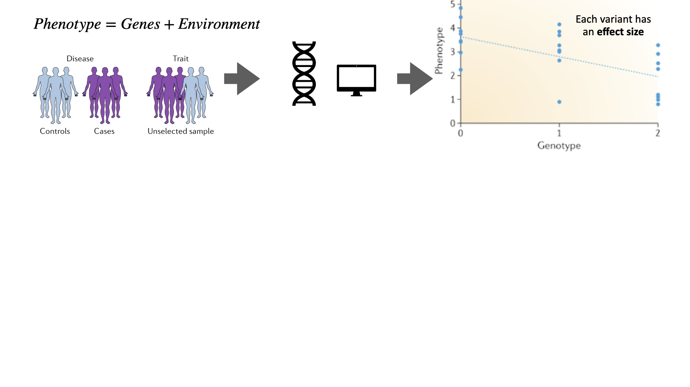
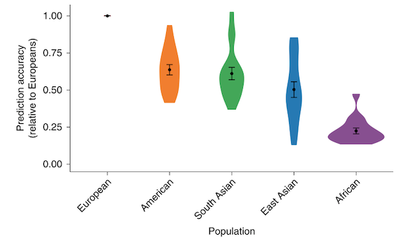
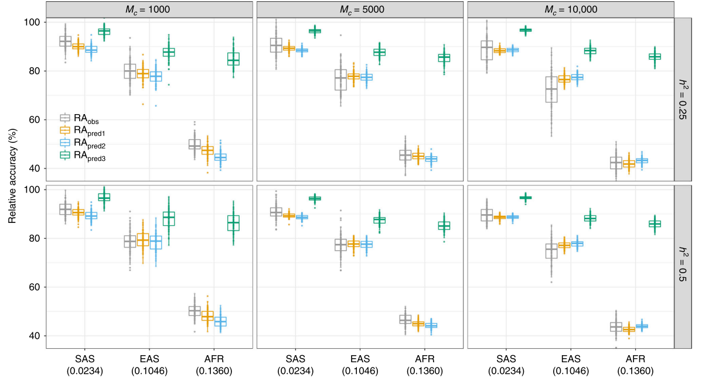
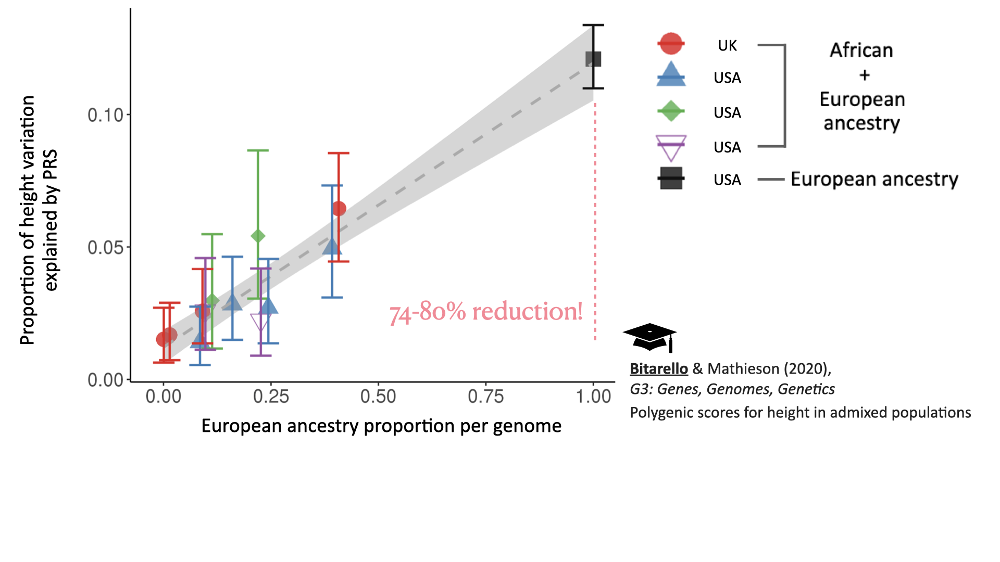

class: center, middle
<style>
.remark-slide-number {
  position: inherit;
}

.remark-slide-number .progress-bar-container {
  position: absolute;
  bottom: 0;
  height: 4px;
  display: block;
  left: 0;
  right: 0;
}

.remark-slide-number .progress-bar {
  height: 100%;
  background-color: gray;
}
</style>

```{r setup, include=FALSE}
options(htmltools.dir.version = FALSE)
library(knitr)
library(shiny)
library(ggplot2)
library(data.table)
library(scales)
library(xaringanExtra)
knitr::opts_chunk$set(tidy = FALSE, eval = TRUE)
```
```{r xaringan-tile-view, echo=FALSE}
xaringanExtra::use_tile_view()
xaringanExtra::use_broadcast()
#xaringanExtra::use_animate_all("slide_left")
xaringanExtra::use_animate_css()
```

```{r xaringan-themer, include=FALSE, warning=FALSE}
library(xaringanthemer)
#xaringanthemer::style_duo_accent(primary_color = "#D8A499",secondary_color = "#7294D4")
wes_palettes <- list(
  BottleRocket1 = c("#A42820", "#5F5647", "#9B110E", "#3F5151", "#4E2A1E", "#550307", "#0C1707"),
  BottleRocket2 = c("#FAD510", "#CB2314", "#273046", "#354823", "#1E1E1E"),
  Rushmore1 = c("#E1BD6D", "#EABE94", "#0B775E", "#35274A" ,"#F2300F"),
  Rushmore = c("#E1BD6D", "#EABE94", "#0B775E", "#35274A" ,"#F2300F"),
  Royal1 = c("#899DA4", "#C93312", "#FAEFD1", "#DC863B"),
  Royal2 = c("#9A8822", "#F5CDB4", "#F8AFA8", "#FDDDA0", "#74A089"),
  Zissou1 = c("#3B9AB2", "#78B7C5", "#EBCC2A", "#E1AF00", "#F21A00"),
  Darjeeling1 = c("#FF0000", "#00A08A", "#F2AD00", "#F98400", "#5BBCD6"),
  Darjeeling2 = c("#ECCBAE", "#046C9A", "#D69C4E", "#ABDDDE", "#000000"),
  Chevalier1 = c("#446455", "#FDD262", "#D3DDDC", "#C7B19C"),
  FantasticFox1 = c("#DD8D29", "#E2D200", "#46ACC8", "#E58601", "#B40F20"),
  Moonrise1 = c("#F3DF6C", "#CEAB07", "#D5D5D3", "#24281A"),
  Moonrise2 = c("#798E87", "#C27D38", "#CCC591", "#29211F"),
  Moonrise3 = c("#85D4E3", "#F4B5BD", "#9C964A", "#CDC08C", "#FAD77B"),
  Cavalcanti1 = c("#D8B70A", "#02401B", "#A2A475", "#81A88D", "#972D15"),
  GrandBudapest1 = c("#F1BB7B", "#FD6467", "#5B1A18", "#D67236"),
  GrandBudapest2 = c("#E6A0C4", "#C6CDF7", "#D8A499", "#7294D4"),
  IsleofDogs1 = c("#9986A5", "#79402E", "#CCBA72", "#0F0D0E", "#D9D0D3", "#8D8680"),
  IsleofDogs2 = c("#EAD3BF", "#AA9486", "#B6854D", "#39312F", "#1C1718")
)

style_duo_accent(primary_color = "#7294D4", 
          secondary_color = "#D8A499",
          text_bold_color = "#E6A0C4",
          title_slide_text_color = "#C6CDF7",
          title_slide_background_color = "#D8A499",
          text_font_size=3,
          header_font_google = google_font("Josefin Sans"),
          text_font_google   = google_font("Montserrat", "300", "300i"),
          code_font_google   = google_font("Fira Mono"),
          colors = c(
  pink = "#E6A0C4",
  cornflowerblue = "#7294D4",
  weirdbrown = "#D8A499",
  lilac="#C6CDF7",
  gray="#8D8680",
  green="#78B7C5",
  orange="#F2AD00"
)
)
extra_css <- list(
  ".small" = list("font-size" = "90%"),
  ".large" = list("font-size" = "120%"),
  ".LARGE" = list("font-size" = "150%"),
  ".full-width" = list(
    display = "flex",
    width   = "100%",
    flex    = "1 1 auto"
  )
)

```
# .pink[Investigating the lack of transferability of polygenic risk scores in cohorts with mixed ancestry]

### .lilac[Bárbara Domingues Bitarello]

### .lilac[Postdoctoral Scholar]

### .weirdbrown[Perelman School of Medicine, University of Pennsylvania]

???
Good afternoon everyone, my name is Bárbara and I am a postdoctoral scholar in the genetics department of the school of medicine at Upenn. I am excited to present my research to all of you today.
---
class: middle, center

## Similar, but .weirdbrown[different]
```{r, out.width = "780px",echo=FALSE, eval=T}
knitr::include_graphics("figs/intro/tarsila.png")
```

.large[.gray[*"Operários"*, Tarsila do Amaral (1933) [Source: www.wikiart.org]]]

???
A quick look around on the street, or at work, can make it clear that we, as a species, carry a lot of diversity. We differ in height, some diseases run in our families, some of us have asthama and can't see well, and so on.

Part of that diversity is rooted in genetics, while another part is due to the environment. Teasing those apart and understanding where diversity comes from is the central goal of population genetics. 
---
class: center, top
# Genome-wide association studies detect **.weirdbrown[genetic associations]** to traits of interest

```{r, out.width = "975px",echo=FALSE, eval=T}
knitr::include_graphics("figs/meat/schemas/schemas.031.png")
```

---

class: center, top
# Genome-wide association studies detect **.weirdbrown[genetic associations]** to traits of interest

```{r, out.width = "975px",echo=FALSE, eval=T}

```

---

class: center, top
# Genome-wide association studies detect **.weirdbrown[genetic associations]** to traits of interest

```{r, out.width = "975px",echo=FALSE, eval=T}
knitr::include_graphics("figs/meat/schemas/schemas.033.png")
```
???

chosen. Typically a binary trait such as presence or absence of disease status or a continuous trait, like height. A large cohort of individuals has their phenotype measured, and their genetic data analysed. Then, each variant is tested as shown in this plot on the right as to wehther it has an effect in the phenotype or not. In this fake example, depending on the genotype in this variant, the individual has remarkably different phenotypes. Next, each variant is represented in a plot such as this one, called a manhattan plot, where the peaks suggest the approx geneomic location of variants associated with the trait. Finally, the results from a gwas may be used in a so called polygenic score to asess the disease/phenotype status of a invidiaul outside the initial discovery cohort. 
A picture that has emerged from human genetics from a biomedical standpoint is that most genomic variants (or polymorphisms) that have a statistically significant association with a disease or trait are somewhat common (appreciable frequencies) and have a realtively small 'effect size'. On the other hand, what you may have learned as monogenic diseases/traits, such as muscualr distrofia

This results in the landscape of polygenic traits to look something like we see on the right: GWAS are mostly successful at capturing variants between these two diagonal lines: common, with moderate or small effect variants, and some rare but highly penetrant mutations, that is, that have a considerable effect size.
Rare variants with small effect sizes are difficult to identify using GWAS, and common variants with large effects are unusual for common complex diseases

---

class: center, top
# Genome-wide association studies detect **.weirdbrown[genetic associations]** to traits of interest

```{r, out.width = "975px",echo=FALSE, eval=T}
knitr::include_graphics("figs/meat/schemas/schemas.034.png")
```
???

GWAS are big scale studies. It works roughly like this: a trait of interest is 
---
class: middle, center

# .pink[Combined,] these variants can explain .pink[a lot] of the .pink[phenotypic variance!]

???

So you might be thinking this is bad news in terms of predicting outcomes. So although most of these variants we detect in genome-wide association studies have very small effect, when you add them up, they explain quite a lot of the variation in a trait. How, you may ask. let's rewind a bit.

---
class: center, top

## Polygenic risk scores combine *.weirdbrown[all]* associated variants for a trait
.pull-left[.full-width[
$$PRS=\sum {\hat\beta G}$$ 

$\hat\beta$ : effect size (from GWAS)

$G$ : Effect allele dosage

### **easy**

### **promising**

### **fast**

### **minimal requirements**
]]

.pull-right[.full-width[

### .weirdbrown[cardiovascular disease]
Khera et al. (2018) *Nat Genet*

```{r, out.width = "320px",echo=FALSE, eval=T}
knitr::include_graphics("figs/cad.png")
```

]]

???
So you did a GWAS for height. Then, for each variant in the genome you have something like this: the genotype in that locus has an effect on height, and can be modelled as a linear relationship. So you have an effect size for one allele in that locus, which is a correlation between the phenotype and the genotype.

Then you make some assumptions about independence of these loci and that an additive model is appropriate and you have this polygenic score, which is a weighted sum of the genotypes in an individuals. Weighted by the effect sizes.

So as you can see from this, PRS are very appealing...They are easy and simple to implement, all you need are some summary statistics from a GWAS, and no further complicated modeling.

Here is one promising example. The x axis shows the percentile of polygenic score. And the y axis shows the pravalence of CAD. IF we look at the highest bins of PRS, prevalance of CAD is 10%. These individuals have a 8-fold increase of CAD compared to the rest of the population. This makes the PRS able to find 20-fold mroe people at risk for CAD than if you were simply testing for large effect mutations, which have large effect but are rare.
---
class: middle, center
# Some examples

```{r, echo=F}
dt2<-data.table(Phenotype=c('height', 'schizophrenia', 'ADHD', 'breast cancer', 'cardiovascular disease (CAD)'), Statistic=c(rep('R-squared',3), rep('AUC',2)), Value=round(c(25,7,5.5,60,81),1), Variants=c(3000,100,100,1000,6000))
knitr::kable(dt2)
```

### PS: In **Europeans...**

???
 There are a few other examples like this sofar for breast cancer for instance. The main point I want to emphasize is...This is for individuals with European ancestry.
 
To mention a few examples, height is one of the most well-studied and most polygenic traits we know of. So far more than 3,000 independently associated variants have been uncovered through GWAS and together they explain about 25% of variation in height as show by linear regression models. For schizophrenia and ADHD, those values are between 5.5-7%. That might seem low, but actually it isn't if you think about this...

The main point I want to emphasize is...This is for individuals with European ancestry.
---

class: middle, center

# What about .pink[ancestry?]

???
right. So what about ancestry?

---

class: center, top
.pull-left[.full-width[
## .weirdbrown[European ancestry] represents almost .weirdbrown[80% of GWAS] participants...
```{r, out.width = "370px",echo=FALSE, eval=T}
knitr::include_graphics("figs/Screen Shot 2020-09-16 at 4.28.04 PM.png")
```
]]

--
.pull-right[.full-width[

```{r, out.width = "1600px",echo=FALSE, eval=T}
knitr::include_graphics("figs/meat/schemas/schemas.041.png")
```

https://worldpopulationreview.com/

## ... and .weirdbrown[ less than 15%] of the world's population 


Sirugo et al. (2019), *Cell*
]]

???
Ok, so let's look at this pie chart from last year, with the proportion of individuals from Each of these groups of ancestry that appear in GWAS. Europeans make up almost 80%, Asians about 20% and Africans about 2%. Note that this is a big improvement since 2009. The same survey in 2009 showed that 96% of individuals were European!

Anyway, now look at this pie chart on the right, which I made from data from worldpopulationreview for 2020. Now, the colors are not a true match, but I did my best. BEar in mind that the plot on the left is about ancestry, and the one on the right is about continents, regardless of ancestry. Nevertheless, it's a reasonable approximation for this purpose. Europeans in Blue represent a disproportionate amount of GWAS participants especially if you consider their share of the world's population. Asian POPULATION represent 60% of the world and ASIAN ANCESTRY only 10% of GWAS, and African POPULATION 17 and AND AFRICAN ANCESTRY 2%. Not to mention the other ancestries which are virtually non-existent.

A natural question then is: how does this affect polygenic risk scores?
---
class: center, top
## PRS accuracy .weirdbrown[decreases] with genetic distance from Europeans

```{r, out.width = "690px",echo=FALSE, eval=T}

```

Martin et al. (2019) *Nat Genet*

???
this is obviously not ideal and reflects many biases which I don't have time to go into to, but considering the hype i showed about PRS before, how does this affect popygenic risk score predictions?

Over the past two years or so a few papers have come out showing that prediction accuracy from PRS decreases with genetic distance from Europeans.
This figure from Martin et al showes average prediction accuracies for 17 traits, using GWAS summary statisticas derived from 100% European cohorts. I am not sure what american means?
---
class: top,center

## PRS accuracy .weirdbrown[decreases] with genetic distance from Europeans
```{r, out.width = "670px",echo=FALSE, eval=T}

```

Wang & Wisscher (2020) *Nat Comms*

###.weirdbrown[LOA:] loss of accuracy
???
And wang & wisscher recently showed through simulations tat this is expected. On the x axis here you have south asians, east asians and africans, and they axis shows the reltive accuracy, i.e, divided by Eur accuracy. It's expected to decline under a range of genetic architectures. I won't go into this but the different colors here represent different estimators they used. 
For the remainder of this talk I will use LOA to refer to this loss of accuracy
---
class: middle, center


# What .weirdbrown[factors] affect prediction accuracy?


# What can we .weirdbrown[do] about it?


???
So the questions that motivated this work were: how 

What about empirically? What does this look like? Ideally, we would have diverse GWAS, so that phenotypic prediction would be informed by ancestry background. But as I showed, that's far from being the case. So what can we do.
---

class: top, center


# .weirdbrown[Many factors] may influence  PRS loss-of-accuracy

.pull-left[.full-width[

### .pink[causal variants]


### .pink[local selection]


### .pink[gene-gene interactions]


### .pink[gene-environment interactions]
]]
.pull-right[.full-width[

### .pink[marginal effect sizes]


### .pink[genomic LD patterns]


### .pink[site frequency spectrum]


### .pink[phenotypic variance]


]]

--
## These factors are .weirdbrown[not mutually exclusive!]

???
Many factors can affect PRS prediction accuracy. Causal variants might actually differ to some extent accross ancestries. There might have been local selection in some populations but not others. There might be population-specifc gene-gene and gene-E interactions.

Also, marginal effect sizes might differ for a number of reasons, and we know that LD patters and SFS patterns differ across ancestries and can impact this RA. Finally, phenotypic variance might actually differ. So in my work taht I am about to show you, I explored these factors highlighted here.

---

class: middle, left

## What .weirdbrown[factors] affect prediction accuracy?

### .pink[Approach:] verify how well we can predict a phenotype in different ancestry populations and investigate the .weirdbrown[causes for discordance]

## What can we .weirdbrown[do] about it?

### .pink[Approach:] explore approaches to .weirdbrown[account for ancestry] 

???
So the questions that motivated this work were:
---
class: middle, center

# Let's look at .pink[height]
???
We chose to look at height because it is ahighly heritable trait, that is, it has a large genetic component.
---
class:center, top
# Predicting .weirdbrown[height] in individuals with .weirdbrown[admixed ancestry]

```{r, out.width = "1000px",echo=FALSE, eval=T}
knitr::include_graphics("figs/meat/schemas/schemas.035.png")
```

---
class:center, top
# Predicting .weirdbrown[height] in individuals with .weirdbrown[admixed ancestry]

```{r, out.width = "1000px",echo=FALSE, eval=T}
knitr::include_graphics("figs/meat/schemas/schemas.036.png")
```
???
why height? It's a somehwat well-udnerstood trait. it's hgihly popygenic and easy to measure. It is highly heritable (80% based ont twin studies, about 50% based on SNP heritability)

Also, it is rather easy to measure and is measured in most biomedical studies, so that increases the amount of available data. We used GWAS results for height that were performed in more than 3000K inds from the UK Biobank. That includes exclusively individuals whose main ancestry component is European.
Then, we selected almost 30,000 indds from independent cohorts ranging from about 0-100% african ancestry. For those individuals, we had genetic and phenotypic data, that is, their height, as well as their age and biolofical sex, important covariates for height.
We then calculated polygenic scores for height for each individual, using effect sizes from the Eurpean ancestry cohort.
Importantly, unlike most studies, we consdierted ancestry as a continuous variable going from 0-100% european ancestry. So each individuals we analysed had a "proportion of Eur ancestry" inferred by local ancestry inference and averaged across the genome.

In the end we looked at about 19,000 individuals with admied ancestry, and 10,000 with eur ancestry from different cohorts.

we modell height as a function of sex age and eur ancesty and compare that to a mdoel that also includes prs.

---
class:center, top
# Predictive power *.weirdbrown[increases]* with genomic proportion of .weirdbrown[European ancestry]
```{r, out.width = "1000px",echo=FALSE, eval=T}
knitr::include_graphics("figs/meat/schemas/schemas.037.png")
```
???
Here we have the main finding. Explain this figure.
We then proceeded to investifate, one by one, the different methodological and statistical factors that could be driving this and concluded that there is no simply fix to this loss of prediction. That is, the fix would have to happen upstream, i.e, the discovery cohorts need to be more diverse. 
---
class:center, top
# Predictive power *.weirdbrown[increases]* with genomic proportion of .weirdbrown[European ancestry]
```{r, out.width = "1000px",echo=FALSE, eval=T}

```


---
class: middle, center

# .weirdbrown[Why] is PRS accuracy a function of genomic proportion of .weirdbrown[European ancestry]?
???
We chose to look at height because it is ahighly heritable trait, that is, it has a large genetic component.
---
class: top, left
##  .weirdbrown[Surprisingly], this relationship seems to be .weirdbrown[quadratic]
.pull-left[.full-width[
```{r, out.width = "670px",echo=FALSE, eval=T}
knitr::include_graphics("figs/Fig1b.png")
```


]]

.pull-right[.full-width[

$$y=0.15p_{eur}^k$$

$k=1$ 

all predictive power comes from European chunks


$k=2$

predictive power is uniformly distributed 

]]

But see Marnetto et al. (2020) *Nat Comms* for conflicting findings.

???
Using only EUR chunks of each genome
In both scenarios, mroe Eur ancestry means more data, so of course prediction increases, but while kappa=1 entails that it is the EUr chunks themselves that contribute to this, kappa=2 entails that 
 On the other hand, if the predictive power were uniformly distributed across the EUR and AFR chunks of the genome, we would expect a quadratic relationship: the partial-R2 of the whole genome (which scales linearly with ancestry) would be multiplied by the proportion of the genome in European ancestry segments (i.e., ancestry). Our observations are intermediate to these extremes (Figure 1B). We conclude that the predictive power of the PRS is enriched in, but does not entirely come from, the European ancestry segments of the admixed genomes, suggesting that the ancestry-specific interactions might play a role.
 
 : Using only European ancestry segments.
The orange lines represent the equation y ¼ 0:15pk
eur, for k={1,1.5,2}. k
= 1 and k = 2 represent the extreme cases where the predictive power
in admixed individuals comes entirely from European ancestry segments of the genomes (k = 1) or is uniformly distributed across the
whole genome (k = 2).

We next restricted the PRS SNPs to those found in segments of the
genome inferred to have European ancestry (Figure 1B). If the
predictive power of the PRS came entirely from these segments, then
we would expect the relationship between ancestry and partial-R2 to
be the same as when we used the whole genome (i.e., linear as in
Figure 1A). On the other hand, if the predictive power were uniformly
distributed across the genome, we would expect a quadratic relationship: the partial-R2 of the whole genome (which scales linearly with
ancestry) would be multiplied by the proportion of the genome in
European ancestry segments (i.e., ancestry). Our observations are
intermediate to these extremes (Figure 1B). We conclude that the
predictive power of the PRS is enriched in, but does not entirely come
from, the European ancestry segments of the admixed genomes,
suggesting that the ancestry-specific interactions might play a role.
---
class: top, left
## Allele frequencies explains up to .weirdbrown[20% of LOA]

.pull-left[.full-width[
```{r, out.width = "370px",echo=FALSE, eval=T}
knitr::include_graphics("figs/Fig4c.png")
```
]]

.pull-right[.full-width[
### .pink[Additive genetic variance]

$$G_{PRS}=\frac{\sum2f_{i_afr}(1-f_{i, afr})\beta_{i,eur}^2}{\sum2f_{i,eur}(1-f_{i,eur})\beta_{i,eur}^2}$$

Bitarello & Mathieson (2020), *G3: Genes, Genomes, Genetics*
]]


---
class: top, center
##Phenotypic variance .weirdbrown[does not] change with ancestry

.pull-left[.full-width[

genome-wide genetic variance in EUR is $\sim 76\%$ of that in AFR

$$height\sim Sex+Age+ Age^2+p_{eur}$$
####.gray[Mean+1 1sd, constant variance]

####.orange[Phenotypic variance is 100% in AFR and 76% in EUR]

$$y=\mu+\beta p_{j, eur}+\epsilon; \epsilon_{j}\sim N(0,\delta ^2  + \gamma p_{j, eur})$$

####.green[fitted, variable variance]

Bitarello & Mathieson (2020),*G3: Genes,Genomes,Genetics*

]]

.pull-right[.full-width[
```{r, out.width = "460px",echo=FALSE, eval=T}
knitr::include_graphics("figs/FigureS13.png")
```

]]


???
We combined all 29,746 individuals (Table 1, UKB_eur excluded)
and computed the residuals yi of the regression of height on sex,
dataset, age, age2
, sexdataset, sexage, sexage2
, datasetage, datasetage2
. We then fitted a linear model for residual height as a
function of the ancestry of individual j  and allowed the
variance to vary linearly with ancestry.

Gray lines show mean height, and dashed lines show ∓1 sd. In orange, we show the expected sd if it were negatively dependent on European ancestry. In green, we show the fitted model with variable variance, which is not significantly different from the constant variance model (gray). We reject the model (orange line) whereby the phenotypic variance in people with 100% European ancestry is 76% that of people with 0% European ancestry.
---
class: top, center
## Differences in linkage disequilibrium

```{r, out.width = "670px",echo=FALSE, eval=T}
knitr::include_graphics("figs/LD_SCHEMA.png")
```


---
class: top, center
## **Prediction 1:** better tagging of causal variants decreases .weirdbrown[LOA]
--

```{r, out.width = "570px",echo=FALSE, eval=T}
knitr::include_graphics("figs/Fig4a.png")
```

[Bitarello & Mathieson (2020), *G3: Genes, Genomes, Genetics*]

### **Observation:** Imputation .weirdbrown[does not] influence .weirdbrown[LOA]
---
class: top, left
## **Prediction 2:** LOA is .weirdbrown[independent] of LD differences

$$Rel_{R2}=\frac{R^2_{bin}}{R^2_{total}}$$

.pull-left[.fix-width[
```{r, out.width = "700px",echo=FALSE, eval=T}
knitr::include_graphics("figs/LD_cartoon.001.jpeg")
```
]]
.pull-right[.fix-width[
```{r, out.width = "700px",echo=FALSE, eval=T}
knitr::include_graphics("figs/LD_cartoon.002.jpeg")
```
]]
###**Similar** slopes

---
class: top, left
## **Prediction 3:** LOA is .weirdbrown[dependent] of LD differences

$$Rel_{R2}=\frac{R^2_{bin}}{R^2_{total}}$$

.pull-left[.fix-width[
```{r, out.width = "600px",echo=FALSE, eval=T}
knitr::include_graphics("figs/LD_cartoon2.001.jpeg")
```
]]
.pull-right[.fix-width[
```{r, out.width = "600px",echo=FALSE, eval=T}
knitr::include_graphics("figs/LD_cartoon2.002.jpeg")
```
]]
###**Different** slopes
???
If LD differences between African and European haplotypes drive
the pattern seen in Figure 1, then a PRS constructed from SNPs in low
recombination regions should be more transferable than a PRS
constructed from SNPs in high recombination regions of the genome
---
class: top, center

###**Observation:** LOA is **somewhat** dependent on recombination rate

.pull-left[

$$Rel_{R2}=\frac{R^2_{bin}}{R^2_{total}}$$

```{r, out.width = "100px",echo=FALSE, eval=T}

```
]

.pull-right[.fix-width[

```{r, out.width = "500px",echo=FALSE, eval=T}
knitr::include_graphics("figs/Fig3b.png")
```
####Recombination Rate

Bitarello & Mathieson (2020), *G3: Genes, Genomes, Genetics*
]]

???
s. On the
other hand, we note that, even for the quartile of lowest recombination, the reduction in partial-R2 for admixed individuals is substantial – 76% on average across datasets – compared to 84% for the
fourth quantile (Figure 3A). Thus, even if all PRS variants were from
low recombination regions, we would still observe a substantial
reduction in predictive power.
---
class: top, center
### Differences in effect sizes .weirdbrown[increase] with .weirdbrown[allele frequency differences]

.pull-left[.full-width[

$y=sex+age+age^2+10PCs$

$N_{AFR}\sim8,800; N_{EUR}\sim350,000$

```{r, out.width = "480px",echo=FALSE, eval=T}
knitr::include_graphics("figs/Fig3c.png")
```

]]


.pull-left[.full-width[

$$\chi_{diff}^2=\left[\frac{\beta_{eur}-\beta_{afr}}{\sqrt{SE_{eur}^2+SE_{afr}^2}}\right]^2$$

```{r, out.width = "480px",echo=FALSE, eval=T}
knitr::include_graphics("figs/Fig5b.png")
```
]]

.pull-center[
Bitarello & Mathieson (2020), *G3: Genes, Genomes, Genetics*
]


???
We calculated allele frequencies for all variants in the HRS_afr and
HRS_eur subsets separately. We defined 10 Kb windows around each
PRS SNP and calculated the mean squared frequency difference
between subsets for all the SNPs contained in the window. We
explore the effect size difference for AFR and EUR (Equation 1)
for each PRS SNP as a function of the mean squared frequency
difference in the window surrounding each SNP.

Differences in marginal effect size
The marginal effect size at a PRS SNP depends on the cumulative effects
of the causal variants that it tags. Therefore, marginal effect sizes at PRS
variants across ancestries might differ for several reasons, including
local epistasis or allelic heterogeneity. When we ignore effect sizes and
calculate the unweighted PRS, we see a similar pattern to Figure 1A
(Figure 5A), suggesting that not only marginal effect sizes but even
directions differ between ancestries. That we can improve the predictive
power of PRS by including effect sizes re-estimated in African ancestry
populations (Figure 2) also indirectly supports the role of effect size
differences. Finally, we find that allele frequencies differ more between
African and European populations around SNPs with larger effect size
differences, although the effect is rather small (r = 0.0005; P = 0.0327;
Figure 5B, Figure S13). These results suggest that marginal effect sizes
differ across ancestries and that this is one of the factors underlying the
reduction in predictive power.

---
##.weirdbrown[Assuming] there .weirdbrown[are differences] in marginal effect sizes

$$PRS_1^{C}=\alpha PRS_{AFR}+(1-\alpha) PRS_{EUR}$$
Marquez-Luna *et al.* (2018) *Genet Epidem*

--

$$PRS_2^{C}=\alpha(1-p_{eur,j}) PRS_{afr,j}+(1-\alpha+\alpha p_{eur,j}) PRS_{EUR}$$
Bitarello & Mathieson (2020), *G3: Genes, Genomes, Genetics*
--

$$PRS_3^{C}= \alpha\left[\sum_{i\in AFR}\beta_{i, afr} G_{i}\right]+(1-\alpha)\left[\sum_{i\in AFR}\beta_{i, eur} G_{i}\right]+\left[\sum_{i\in EUR}\beta_{i, eur} G_{i}\right]$$
Bitarello & Mathieson (2020), *G3: Genes, Genomes, Genetics*
---
class:left
###**Prediction:** ancestry-specific effect sizes improve accuracy for admixed individuals

.center[
```{r, out.width = "590px",echo=FALSE, eval=T}
knitr::include_graphics("figs/Fig2.png")
```

Bitarello & Mathieson (2020), *G3: Genes, Genomes, Genetics*
]

###**Observation:** Modest improvement 
---
class:left, top
## .pink[Take Home Messages & Ongoing work]


### * PRS have little/no utility for ancestries .weirdbrown[other than European]

### * Many factors; need to .weirdbrown[diversify genetic studies] at all stages

--

### * optimizing .weirdbrown[ancestry-sensitive] approaches

### * make .weirdbrown[LD reference panels] available for diverse ancestries

### * explore ancestry-dependent gene-gene interactions


???
Marginal effect size results suggest there might be something worth looking into there. Perhaps local epistasis or other population-specific phenomena.

---

class: top, center
# Acknowledgements

.pull-left[.full-width[

### .weirdbrown[Iain Mathieson - UPenn]


#### Mathieson Lab

```{r, out.width = "110px",echo=FALSE, eval=T}
knitr::include_graphics("figs/PerelmanSchoolofMedicineLogoVertical.png")
```


```{r, out.width = "100px",echo=FALSE, eval=T}
knitr::include_graphics("figs/NIGMS_logo.jpg")
```

]]

.pull-right[.full-width[
Neale Lab

UK Biobank

Women's Health Initiative

Jackson Heart Study

Health and Retirement Study

1000 Genomes Project


```{r, out.width = "150px",echo=FALSE, eval=T}
knitr::include_graphics("figs/tpf_logo_rgb-Facebook.jpg")
```

]]
---
class: center, middle

# .pink[Thank you!]

# .weirdbrown[Questions?]

## barbara.bitarello@gmail.com


