```{r setup, include=FALSE}
options(htmltools.dir.version = FALSE)
library(knitr)
library(shiny)
library(ggplot2)
knitr::opts_chunk$set(tidy = FALSE, eval = TRUE)
```

```{r xaringan-themer, include=FALSE, warning=FALSE}
library(xaringanthemer)
#xaringanthemer::style_duo_accent(primary_color = "#D8A499",secondary_color = "#7294D4")
wes_palettes <- list(
  BottleRocket1 = c("#A42820", "#5F5647", "#9B110E", "#3F5151", "#4E2A1E", "#550307", "#0C1707"),
  BottleRocket2 = c("#FAD510", "#CB2314", "#273046", "#354823", "#1E1E1E"),
  Rushmore1 = c("#E1BD6D", "#EABE94", "#0B775E", "#35274A" ,"#F2300F"),
  Rushmore = c("#E1BD6D", "#EABE94", "#0B775E", "#35274A" ,"#F2300F"),
  Royal1 = c("#899DA4", "#C93312", "#FAEFD1", "#DC863B"),
  Royal2 = c("#9A8822", "#F5CDB4", "#F8AFA8", "#FDDDA0", "#74A089"),
  Zissou1 = c("#3B9AB2", "#78B7C5", "#EBCC2A", "#E1AF00", "#F21A00"),
  Darjeeling1 = c("#FF0000", "#00A08A", "#F2AD00", "#F98400", "#5BBCD6"),
  Darjeeling2 = c("#ECCBAE", "#046C9A", "#D69C4E", "#ABDDDE", "#000000"),
  Chevalier1 = c("#446455", "#FDD262", "#D3DDDC", "#C7B19C"),
  FantasticFox1 = c("#DD8D29", "#E2D200", "#46ACC8", "#E58601", "#B40F20"),
  Moonrise1 = c("#F3DF6C", "#CEAB07", "#D5D5D3", "#24281A"),
  Moonrise2 = c("#798E87", "#C27D38", "#CCC591", "#29211F"),
  Moonrise3 = c("#85D4E3", "#F4B5BD", "#9C964A", "#CDC08C", "#FAD77B"),
  Cavalcanti1 = c("#D8B70A", "#02401B", "#A2A475", "#81A88D", "#972D15"),
  GrandBudapest1 = c("#F1BB7B", "#FD6467", "#5B1A18", "#D67236"),
  GrandBudapest2 = c("#E6A0C4", "#C6CDF7", "#D8A499", "#7294D4"),
  IsleofDogs1 = c("#9986A5", "#79402E", "#CCBA72", "#0F0D0E", "#D9D0D3", "#8D8680"),
  IsleofDogs2 = c("#EAD3BF", "#AA9486", "#B6854D", "#39312F", "#1C1718")
)

style_duo_accent(primary_color = "#7294D4", 
          secondary_color = "#D8A499",
          text_bold_color = "#E6A0C4",
          title_slide_text_color = "#C6CDF7",
          title_slide_background_color = "#D8A499",
          header_font_google = google_font("Josefin Sans"),
          text_font_google   = google_font("Montserrat", "300", "300i"),
          code_font_google   = google_font("Fira Mono")
)
```
---

class: center, middle
##Many variants with small effect size

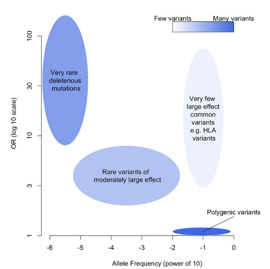


[Crouch & Bodmer (2020 PNAS]

---
class: inverse, center, middle
# Combined, they explain a lot!

---
class: left, middle
# Combined, they explain a lot!

```{r, echo=F}
library(data.table)
dt2<-data.table(Phenotype=c('height', 'schizophrenia', 'ADHD', 'breast cancer', 'cardiovascular disease (CAD)'), Statistic=c(rep('R-squared',3), rep('AUC',2)), Value=c(25,7,5.5,60,81), Variants=c(3000,100,100,1000,6000))
knitr::kable(dt2)
```
---
class: left, top

### Combined, they explain a lot!
.pull-left[.full-width[
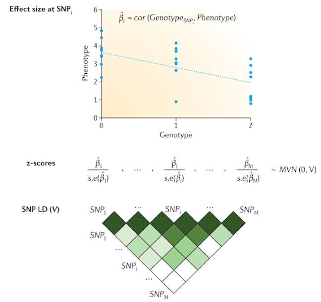

.small[Pasaniuc & Price (2017), *Nat Rev Genet*]


]]

.pull-right[.full-width[


$$PRS=\sum_{i=1}^{m} \hat\beta_{i} G_{j,i}$$ 


$\hat\beta$ : effect size (from GWAS)

$G$ : Effect allele dosage

$j$: Individuals

$i$: SNPs
]]

**independence**

**additive model**

---
class: top, center
# PRSs are appealing

.pull-left[.full-width[
**easy**
--
**promising**
--
]]

--
.pull-right[.full-width[
**fast**
--
**minimal requirements**
--
]]
--
---
class: top,  center
##Promising
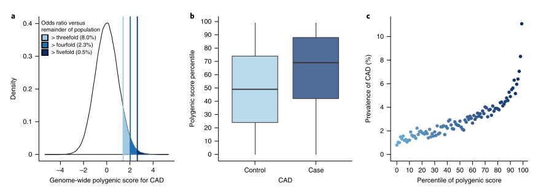

Khera *et. al* (2019) *Nat Genet.*

---
class: middle, center, inverse

#What about ancestry?

---
class: center, top
# Lack of diversity is an issue


---
class: center, middle
# Lack of diversity is an issue
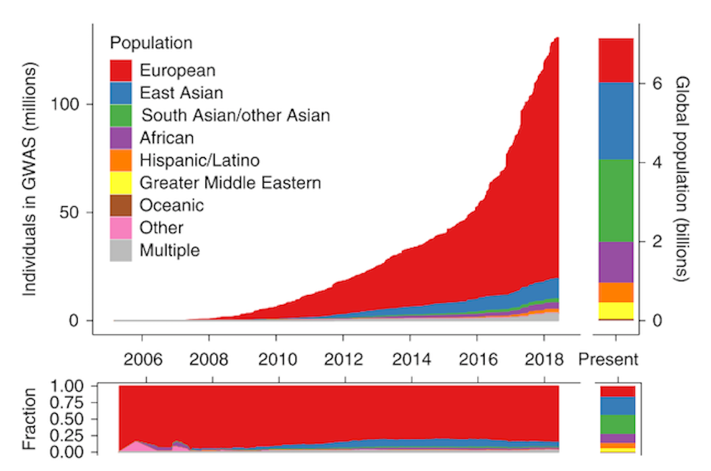
---
class: center, middle, inverse
# How does PRS accuracy transfer across ancestries?

---
class: center, top
## PRS accuracy decreases with genetic distance from Europeans


Martin et al. (2019) *Nat Genet*
---
class: top,center

## PRS accuracy decreases with genetic distance from Europeans


Wang & Wisscher (2020) Nat. Comm

---
class: top, left


# This had been known way before human geneticists became interested


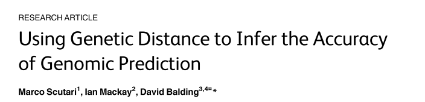
---
class: middle, center, inverse


##Why is this loss of prediction observed?
--

##What can we do about it?
---
class: top, center


# Many factors may impact prediction accuracy
.pull-left[.full-width[

 causal variants 


 local selection


 gene-gene interactions


 gene-environment interactions
]]
.pull-right[.full-width[


 **marginal effect sizes**
--


 **LD **
--

 **site frequency spectrum **
--

**phenotypic variance**

]]
--

###These factors are not mutually exclusive!

---
class: inverse, middle, center
## Questions

### How do these different factors affect prediction accuracy?
### Can we leverage ancestry into the PRS and improve predictions?
---
class: middle, center

#Let's look at height
---
class:  top, left
##Ancestry as a continuous variable

.large[highly polygenic]

.large[many cohorts phenotyped]

.large[large GWAS (UKBB] $\sim$ 360,000 **Europeans**)

--
###European + African ancestry
```{r, include=FALSE}
library(data.table)
library(kableExtra)
dt<-data.table(Data=c('UKBB_eur', 'HRS_EUR','UKBB_afr','WHI_afr', 'JHS_afr', 'HRS_afr'), Ancestry=c('European', 'European','African + European', 'African American', 'African American', 'African American'), N=c(9998, 10159, 8700,6863, 1773,2251), Number_SNPs=c(685475,1511742,685475,741983,702685,1511742))
```
```{r, echo=F}
knitr::kable(dt)
```

.small[Bitarello & Mathieson (2020), *G3*]
---
class: top, center
##PRS accuracy decreases with genetic distance from Europeans


.small[Bitarello & Mathieson (2020), *G3*]
---
class: top, left

##GWAS from UKBB (AFR) individuals


.pull-left[.full-width[
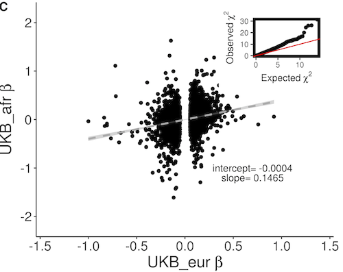

]]


.pull-right[.full-width[

$y=sex+age+age^2+10PCs$

$N_{AFR}\sim8,800$

$N_{EUR}\sim350,000$

$$\chi_{diff}^2=\left[\frac{\beta_{eur}-\beta_{afr}}{\sqrt{SE_{eur}^2+SE_{afr}^2}}\right]^2$$
]]

.small[Bitarello & Mathieson (2020), *G3*]

---
class: top, center
##Using only EUR chunks of each genome


.small[Bitarello & Mathieson (2020), *G3*]

---
class: top, center
## Allelic Frequency Differences explain about 20%

.pull-left[.full-width[

]]
.pull-right[.full-width[
**Additive genetic variance**
$$G_{PRS}=\frac{\sum2f_{i_afr}(1-f_{i, afr})\beta_{i,eur}^2}{\sum2f_{i,eur}(1-f_{i,eur})\beta_{i,eur}^2}$$

]]


Bitarello & Mathieson (2020), *G3*
---
class: top, center

###**Phenotypic** variance does not change with ancestry

genome-wide genetic variance in EUR is $\sim 76%$ of that in AFR
$$y=\mu+\beta p_{j, eur}+\epsilon; \epsilon_{j}\sim N(0,\delta ^2  + \gamma p_{j, eur})$$

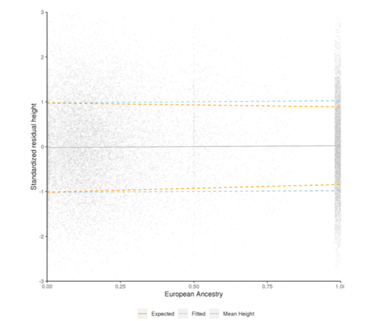
Bitarello & Mathieson (2020), *G3*
---
class: top, center
class: top, center
## Differences in LD?

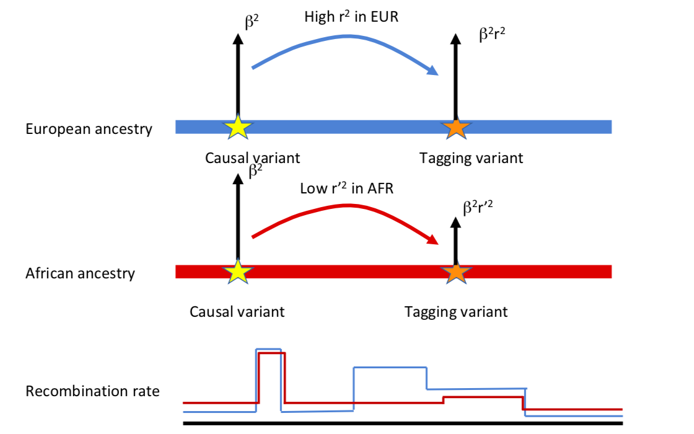


---
class: top, center
##Imputation doesn't help


---
class: top, center
##Is loss of accuracy dependent on recombination rate?
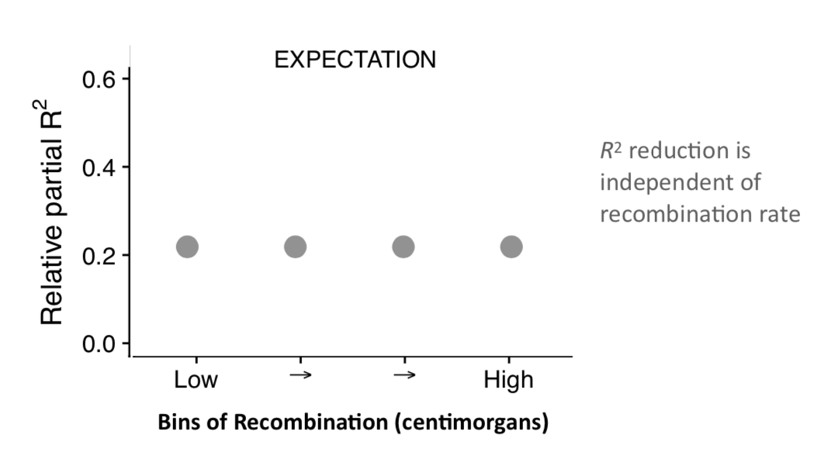

---
class: top, center
##Is loss of accuracy dependent on recombination rate?
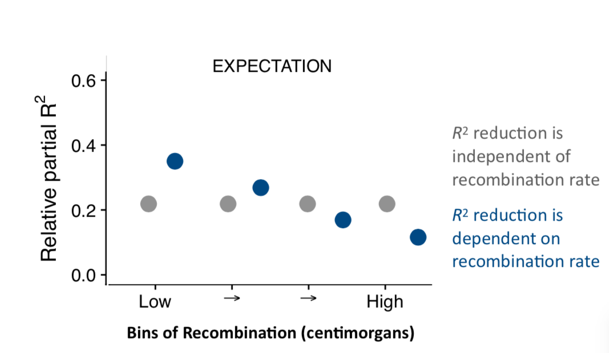

---
class: center
##Loss of accuracy is **somewhat** dependent on recombination rate
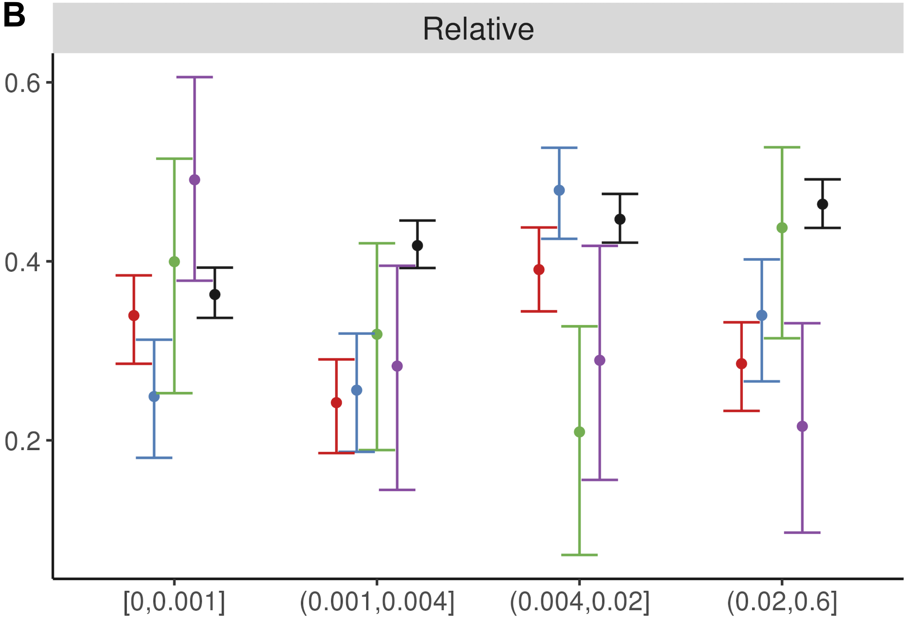

---
class:middle, center
##Differences in **marginal** effect size?
--

 most GWAS variants can be validated in other ancestries

 genetic correlations are high for height
---
class: top, center
##Allele frequency differences across ancestries are larger with increasing difference in marginal effect sizes
.pull-left[.full-width[
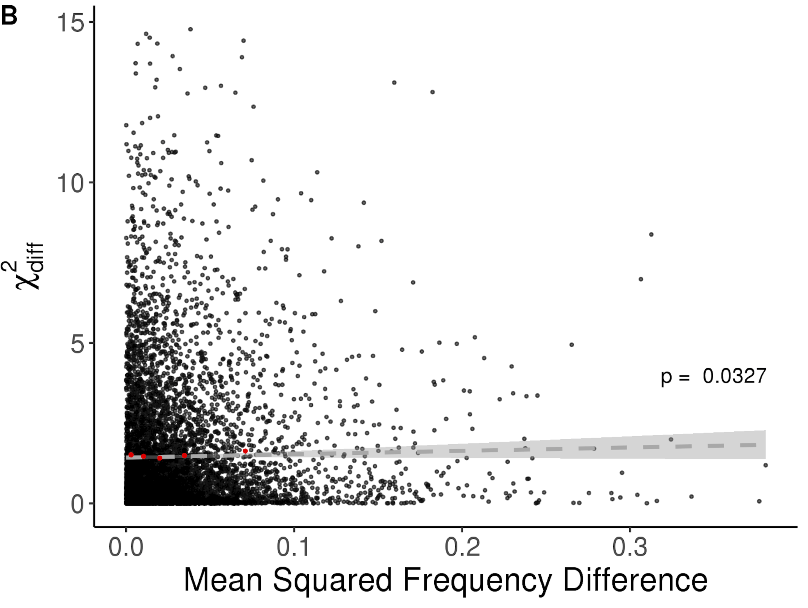
Bitarello & Mathieson (2020), *G3*
]]
.pull-right[.full-width[

$N_{AFR}\sim8,800$

$N_{EUR}\sim350,000$

$$\chi_{diff}^2=\left[\frac{\beta_{eur}-\beta_{afr}}{\sqrt{SE_{eur}^2+SE_{afr}^2}}\right]^2$$


]]
---
class: center
##Assuming there **are** differences in **marginal** effect sizes:


---
class: center
##Assuming there **are** Differences in **marginal** effect sizes:

$$PRS_1^{C}=\alpha PRS_{AFR}+(1-\alpha) PRS_{EUR}$$
Marquez-Luna *et al.* (2018) *Genet Epidem*

--


$$PRS_2^{C}=\alpha(1-p_{eur,j}) PRS_{afr,j}+(1-\alpha+\alpha p_{eur,j}) PRS_{EUR}$$
Bitarello & Mathieson (2020), *G3*
--

$$PRS_3^{C}= \alpha\left[\sum_{i\in AFR}\beta_{i, afr} G_{i}\right]+(1-\alpha)\left[\sum_{i\in AFR}\beta_{i, eur} G_{i}\right]+\left[\sum_{i\in EUR}\beta_{i, eur} G_{i}\right]$$
Bitarello & Mathieson (2020), *G3*
---
class: center
###Improvement in prediction accuracy when using **linear combinations of ancestry-specific** PRS

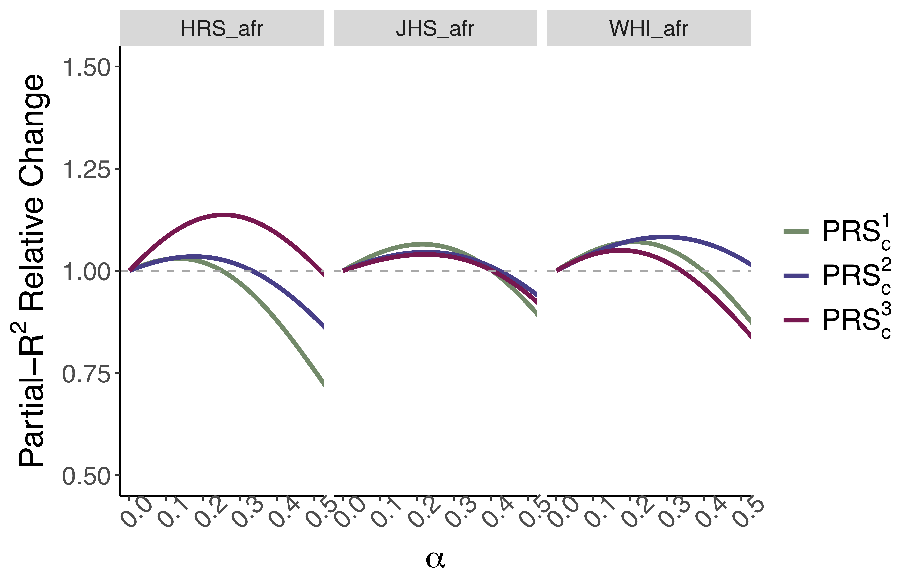
Bitarello & Mathieson (2020), *G3*
---
##Take Home Message

--

* LD and SFS impact PRS accuracy across ancestries

--

* not enough to explain loss of accuracy

--

* marginal effect sizes differences occur

--

* better testing with larger NEA sample sizes

--

**Ongoing**

* optimizing ancestry-sensitive approach

* explore gene-gene 

* include more co-variates?

---
# Acknowledgements

.pull-left[.full-width[

**Iain Mathieson**

Arslan Zaidi

Dan Ju

Laura Colbran

Samantha Cox


]]

.pull-right[.full-width[

Neale Lab

UK Biobank

Women's Health Initiative

Jackson Heart Study

Health and Retirement Study


]]


---

class: center, middle

# Thank you!

# Questions?


