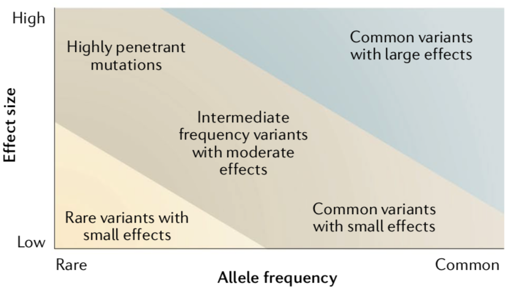
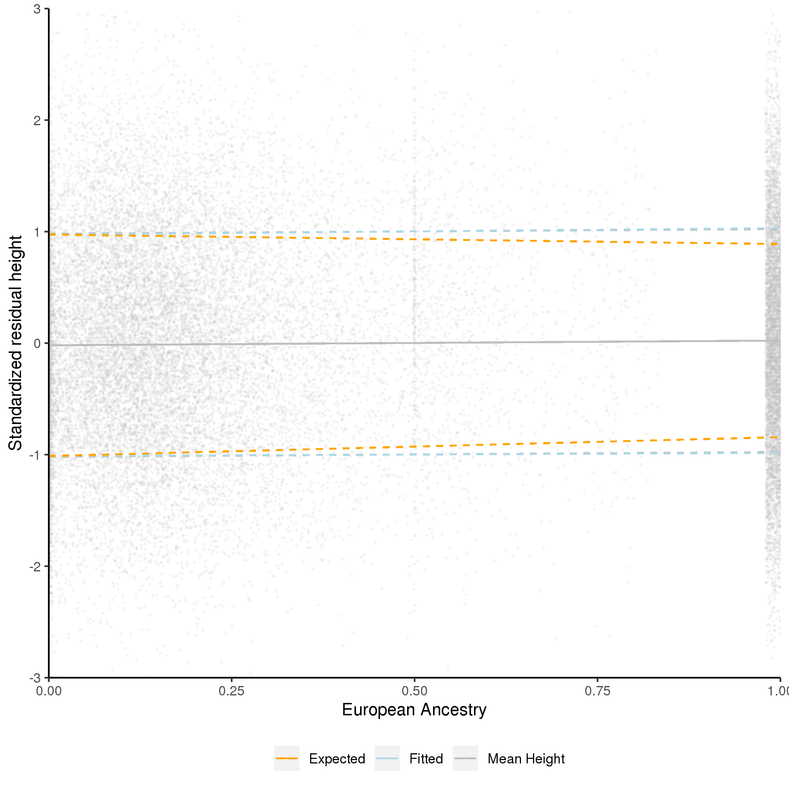
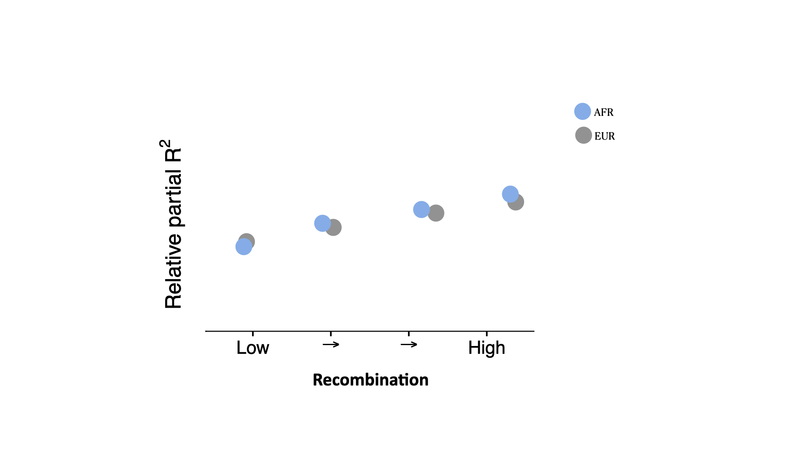
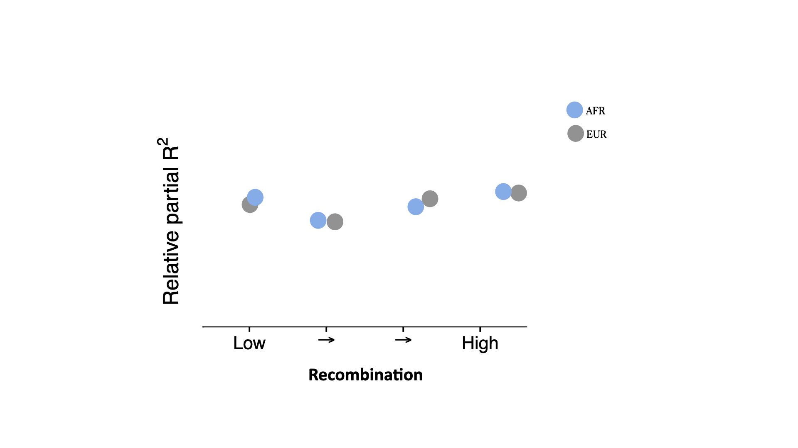
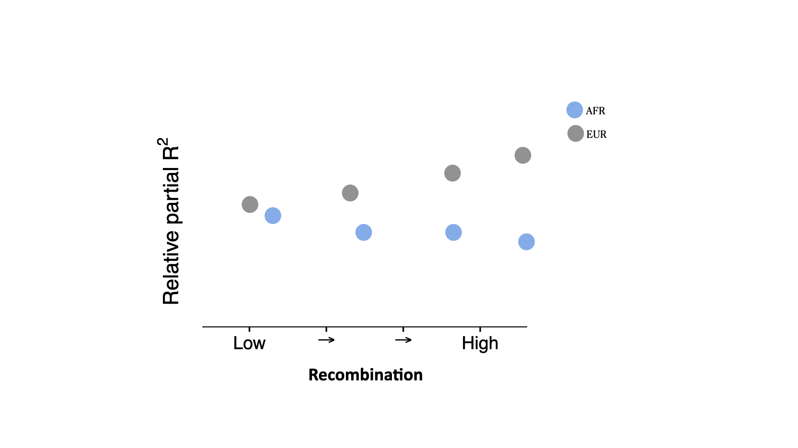

```{r setup, include=FALSE}
options(htmltools.dir.version = FALSE)
library(knitr)
library(shiny)
library(ggplot2)
library(data.table)
library(scales)
library(xaringanExtra)
knitr::opts_chunk$set(tidy = FALSE, eval = TRUE)
```
```{r xaringan-tile-view, echo=FALSE}
xaringanExtra::use_tile_view()
xaringanExtra::use_broadcast()
#xaringanExtra::use_animate_all("slide_left")
xaringanExtra::use_animate_css()
```

```{r xaringan-themer, include=FALSE, warning=FALSE}
library(xaringanthemer)
#xaringanthemer::style_duo_accent(primary_color = "#D8A499",secondary_color = "#7294D4")
wes_palettes <- list(
  BottleRocket1 = c("#A42820", "#5F5647", "#9B110E", "#3F5151", "#4E2A1E", "#550307", "#0C1707"),
  BottleRocket2 = c("#FAD510", "#CB2314", "#273046", "#354823", "#1E1E1E"),
  Rushmore1 = c("#E1BD6D", "#EABE94", "#0B775E", "#35274A" ,"#F2300F"),
  Rushmore = c("#E1BD6D", "#EABE94", "#0B775E", "#35274A" ,"#F2300F"),
  Royal1 = c("#899DA4", "#C93312", "#FAEFD1", "#DC863B"),
  Royal2 = c("#9A8822", "#F5CDB4", "#F8AFA8", "#FDDDA0", "#74A089"),
  Zissou1 = c("#3B9AB2", "#78B7C5", "#EBCC2A", "#E1AF00", "#F21A00"),
  Darjeeling1 = c("#FF0000", "#00A08A", "#F2AD00", "#F98400", "#5BBCD6"),
  Darjeeling2 = c("#ECCBAE", "#046C9A", "#D69C4E", "#ABDDDE", "#000000"),
  Chevalier1 = c("#446455", "#FDD262", "#D3DDDC", "#C7B19C"),
  FantasticFox1 = c("#DD8D29", "#E2D200", "#46ACC8", "#E58601", "#B40F20"),
  Moonrise1 = c("#F3DF6C", "#CEAB07", "#D5D5D3", "#24281A"),
  Moonrise2 = c("#798E87", "#C27D38", "#CCC591", "#29211F"),
  Moonrise3 = c("#85D4E3", "#F4B5BD", "#9C964A", "#CDC08C", "#FAD77B"),
  Cavalcanti1 = c("#D8B70A", "#02401B", "#A2A475", "#81A88D", "#972D15"),
  GrandBudapest1 = c("#F1BB7B", "#FD6467", "#5B1A18", "#D67236"),
  GrandBudapest2 = c("#E6A0C4", "#C6CDF7", "#D8A499", "#7294D4"),
  IsleofDogs1 = c("#9986A5", "#79402E", "#CCBA72", "#0F0D0E", "#D9D0D3", "#8D8680"),
  IsleofDogs2 = c("#EAD3BF", "#AA9486", "#B6854D", "#39312F", "#1C1718")
)

style_duo_accent(primary_color = "#7294D4", 
          secondary_color = "#D8A499",
          text_bold_color = "#E6A0C4",
          title_slide_text_color = "#C6CDF7",
          title_slide_background_color = "#D8A499",
          header_font_google = google_font("Josefin Sans"),
          text_font_google   = google_font("Montserrat", "300", "300i"),
          code_font_google   = google_font("Fira Mono"),
          colors = c(
  pink = "#E6A0C4",
  cornflowerblue = "#7294D4",
  weirdbrown = "#D8A499",
  lilac="#C6CDF7",
  gray="#8D8680",
  green="#78B7C5",
  orange="#F2AD00"
)
)

```
class: inverse, center, middle

# .lilac[What drives the reduced prediction accuracy of polygenic scores in non-European individuals?]

### .lilac[Bárbara Domingues Bitarello]

### .lilac[Perelman School of Medicine, University of Pennsylvania]

???

Good afternoon everyone, or good evening depending on where you are.
Thank you, Debora, for this warm introduction. And thank you CTEG for inviting me to give this talk.

So today I am going to be talking about phenotype prediction using polygenic risk scores, and why they don't work well for any ancestry other than European and, for some traits, East Asian.

---
class: center, top
##**Many** variants

.pull-left[
```{r, out.width = "500px",echo=FALSE, eval=T}
knitr::include_graphics("tam_et_al_2019.png")
```
]


???
Two decades of genomewide association studies, or GWAS, have shown us that most genetically inherited traits are highly polygenic. This means that they dozens, or hundreds or thousands of variants contribute to the trait
---
class: center, top
##**Many** variants with **small** effect size

.pull-left[.full-width[
```{r, out.width = "500px",echo=FALSE, eval=T}
knitr::include_graphics("tam_et_al_2019.png")
```
]]


.pull-right[.full-width[
```{r, out.width = "600px",echo=FALSE, eval=T}

```
]]


[Tam et al. (2019) *Nat Rev Genet*]

???
Also, these variants are largely small in their reffect size.
This results in the landscape of polygenic traits to look something like we see on the right: GWAS are mostly successful at capturing variants between these two diagonal lines: common, with moderate or small effect variants, and some rare but highly penetrant mutations, that is, that have a considerable effect size.
Rare variants with small effect sizes are difficult to identify using GWAS, and common variants with large effects are unusual for common complex diseases
---
class: inverse, center, middle
# .lilac[Combined, they explain a lot!]
???

So although most of these variants we detect in genome-wide association studies have very small effect, when you add them up, they explain quite a lot of the variation in a trait.
---
class: middle, center
# Some examples

```{r, echo=F}
dt2<-data.table(Phenotype=c('height', 'schizophrenia', 'ADHD', 'breast cancer', 'cardiovascular disease (CAD)'), Statistic=c(rep('R-squared',3), rep('AUC',2)), Value=round(c(25,7,5.5,60,81),1), Variants=c(3000,100,100,1000,6000))
knitr::kable(dt2)
```
--


### PS: In **Europeans...**

???

To mention a few example, height is one of the most well-studied and most polygenic traits we know of. So far more than 3,000 independently associated variants have been uncovered through GWAS and together they explain about 25% of variation in height as show by linear regression models. For schizophrenia and ADHD, those values are between 5.5-7%. That might seem low, but actually it isn't if you think about this...
---
class: center, top

## Polygenic risk scores add up those small effects
.pull-left[.full-width[
```{r, out.width = "650px",echo=FALSE, eval=T}

knitr::include_graphics("gwas_schema_pasaniuc_price.png")
```

.small[Pasaniuc & Price (2017), *Nat Rev Genet*]


]]

.pull-right[.full-width[


$$PRS=\sum_{i=1}^{m} \hat\beta_{i} G_{j,i}$$ 


$\hat\beta$ : effect size (from GWAS)

$G$ : Effect allele dosage

$j$: Individuals

$i$: SNPs

**independence**

**additive model**

]]


???
So you did a GWAS for height. Then, for each variant in the genome you have something like this: the genotype in that locus has an effect on height, and can be modelled as a linear relationship. So you have an effect size for one allele in that locus, which is a correlation between the phenotype and the genotype. 

Then you make some assumptions about independence of these loci and that an additive model is appropriate and you have this polygenic score, which is a weighted sum of the genotypes in an individuals. Weighted by the effect sizes.
---
class: top, center
# PRSs are appealing

.pull-left[.full-width[
## **easy**

## **promising**

## **fast**

## **minimal requirements**
]]
.pull-right[.full-width[
```{r, out.width = "460px",echo=FALSE, eval=T}
knitr::include_graphics("cad.png")
```
[Khera et al (2018) Nat Genet]
]]

???
So as you can see from this, PRS are very appealing...They are easy and simple to implement, all you need are some summary statistics from a GWAS, and no further complicated modeling.

Here is one promising example. The x axis shows the percentile of polygenic score. And the y axis shows the pravalence of CAD. IF we look at the highest bins of PRS, prevalance of CAD is 10%. These individuals have a 8-fold increase of CAD compared to the rest of the population. This makes the PRS able to find 20-fold mroe people at risk for CAD than if you were simply testing for large effect mutations, which have large effect but are rare.
There are a few other examples like this sofar for breast cancer for instance.
The main point I want to emphasize is...This is for individuals with European ancestry.

---
class: middle, center, inverse

# .lilac[What about ancestry?]

???
right. So what about ancestry?
---
class: center, top
.pull-left[.full-width[
## European **ancestry** represent almost 80% of GWAS participants...
```{r, out.width = "350px",echo=FALSE, eval=T}
knitr::include_graphics("Screen Shot 2020-09-16 at 4.28.04 PM.png")
```

[Sirugo, Williams & Tishkoff (2019) *Cell*]]]
--
.pull-left[.full-width[

```{r, echo=FALSE, eval=T, out.width = "420px"}
world<-fread('~/Downloads/csvData.csv')
#library(plotly)
blank_theme <- theme_minimal()+
  theme(
  axis.title.x = element_blank(),
  axis.title.y = element_blank(),
  panel.border = element_blank(),
  panel.grid=element_blank(),
  axis.ticks = element_blank(),
  plot.title=element_text(size=14, face="bold")
  )
bp<- ggplot(world, aes(x="", y=WorldPop, fill=Name))+
geom_bar(width = 1, stat = "identity") + coord_polar("y", start=0)+ 
  scale_fill_manual(values=c("red","#E6A0C4","#7294D4", "#999999","#899DA4","#A2A475")) + blank_theme +
  theme(axis.text.x=element_blank()) + 
  geom_text(aes(y=c(0.9,0.4,0.17, 0.10, 0.05, 0.025), label=paste0((c(0.1720, 0.5954, 0.0959, 0.0473,0.0055, 0.0553)*100), "%")), size=c(6,6,6,6,2,3))
 
print(bp)
```
```{r, out.width = "650px",echo=FALSE, eval=F}
knitr::include_graphics("Screen Shot 2020-09-16 at 2.44.43 PM.png")
```
[Data: https://worldpopulationreview.com/]

## .. and <15% of the world's population
]]

???
Ok, so let's look at this pie chart from last year, with the proportion of individuals from Each of these groups of ancestry that appear in GWAS. Europeans make up almost 80%, Asians about 20% and Africans about 2%. Note that this is a big improvement since 2009. The same survey in 2009 showed that 96% of individuals were European!

Anyway, now look at this pie chart on the right, which I made from data from worldpopulationreview for 2020. Now, the colors are not a true match, but I did my best. BEar in mind that the plot on the left is about ancestry, and the one on the right is about continents, regardless of ancestry. Nevertheless, it's a reasonable approximation for this purpose. Europeans in Blue represent a disproportionate amount of GWAS participants especially if you consider their share of the world's population. Asian POPULATION represent 60% of the world and ASIAN ANCESTRY only 10% of GWAS, and African POPULATION 17 and AND AFRICAN ANCESTRY 2%. Not to mention the other ancestries which are virtually non-existent.
---
class: center, middle, inverse
# .lilac[How does PRS accuracy transfer across ancestries?]

???
this is obviously not ideal and reflects many biases which I don't have time to go into to, but considering the hype i showed about PRS before, how does this affect popygenic risk score predictions?
---
class: center, top
### PRS accuracy decreases with genetic distance from Europeans

```{r, out.width = "690px",echo=FALSE, eval=T}
knitr::include_graphics("Screen Shot 2020-09-16 at 10.26.28 PM.png")
```

[Martin et al. (2019) *Nat Genet*]

???
Over the past two years or so a few papers have come out showing that prediction accuracy from PRS decreases with genetic distance from Europeans.
This figure from Martin et al showes average prediction accuracies for 17 traits, using GWAS summary statisticas derived from 100% European cohorts. I am not sure what american means?
---
class: top,center

### PRS accuracy decreases with genetic distance from Europeans
```{r, out.width = "670px",echo=FALSE, eval=T}
knitr::include_graphics("fig1.png")
```

[Wang & Wisscher (2020) *Nat Comms*]

###**LOA:** loss of accuracy
???
And wang & wisscher recently showed through simulations tat this is expected. On the x axis here you have south asians, east asians and africans, and they axis shows the reltive accuracy, i.e, divided by Eur accuracy. It's expected to decline under a range of genetic architectures. I won't go into this but the different colors here represent different estimators they used. 
For the remainder of this talk I will use LOA to refer to this loss of accuracy
#---
#class: middle, center, inverse


## .lilac[This had been known way before human geneticists became interested!]


#

### .lilac[*2003*]
---
class: middle, center, inverse


## .lilac[Why is this loss of prediction observed?]
--

##.lilac[What] can *we do* .lilac[about it?]

???
What about empirically? What does this look like?
Ideally, we would have diverse GWAS, so that phenotypic prediction would be informed by ancestry background. But as I showed, that's far from being the case. So what can we do.
---

class: top, center


## Many factors may influence **LOA**
.pull-left[.full-width[

 causal variants 


 local selection


 gene-gene interactions


 gene-environment interactions
]]
.pull-right[.full-width[


 **marginal effect sizes**


 **LD **


 **site frequency spectrum **


**phenotypic variance**


]]

???
Many factors can affect PRS prediction accuracy. Causal variants might actually differ to some extent accross ancestries. There might have been local selection in some populations but not others. There might be population-specifc gene-gene and gene-E interactions.

Also, marginal effect sizes might differ for a number of reasons, and we know that LD patters and SFS patterns differ across ancestries and can impact this RA. Finally, phenotypic variance might actually differ. So in my work taht I am about to show you, I explored these factors highlighted here.
--

###These factors are not mutually exclusive!

---
class: inverse, middle, center
# .lilac[Questions]

### How do these .lilac[different factors] affect prediction accuracy?
### Can we .lilac[leverage ancestry] into the PRS and improve predictions?

???
So the quesitons that motivated this work were:
---
class: middle, center

#Let's look at height
???
We chose to look at height in individuals with Eur, afr and admixed ancestry.
---
class:  top, center
##Ancestry as a **continuous** variable

.pull-left[.full-width[

#### highly polygenic

#### many cohorts phenotyped

#### large GWAS (UKBB] $\sim$ 360,000 **Europeans**)

$height\sim Sex+Age+ Age^2+p_{eur}$

$height\sim Sex+Age+ Age^2+p_{eur}+PRS$
]

.pull-right[.full-width[
#### European + African ancestry

```{r, include=FALSE}
library(data.table)
library(kableExtra)
dt<-data.table(Data=c('UKBB_eur', 'HRS_EUR','UKBB_afr','WHI_afr', 'JHS_afr', 'HRS_afr'), Ancestry=c('European', 'European','African + European', 'African American', 'African American', 'African American'), N=c(9998, 10159, 8700,6863, 1773,2251), Number_SNPs=c(685475,1511742,685475,741983,702685,1511742))
```
```{r, echo=F}
knitr::kable(dt)
```

[.small[Bitarello & Mathieson (2020), *G3*]]
]]
???
why height? It's a somehwat well-udnerstood trait. it's hgihly popygenic and easy to measure. It is highly heritable (80% based ont twin studies, about 50% based on SNP heritability)

So in this work we used GWAS summary statistics for height from a cohort of 360K europeans from the UK biobank. And we verified how well we could predicti height in individuals with different degrees of african ancestry.

Importantly, unlike most studies, we consdierted ancestry as a continuous variable. So each individuals we analysed had a "proportion of Eur ancestry" inferred by local ancestry inference and averaged across the genome.

In the end we looked at about 19,000 individuals with admied ancestry, and 10,000 with eur ancestry from different cohorts.

we modell height as a function of sex age and eur ancesty and compare that to a mdoel that also includes prs.
---
class: top, center
###PRS accuracy **increases** with proportion of European ancestry

```{r, out.width = "670px",echo=FALSE, eval=T}
knitr::include_graphics("Fig1a.png")
```


[.small[Bitarello & Mathieson (2020), *G3*]]
---
class: top, center

###GWAS from UKBB (AFR) individuals

.pull-left[.full-width[
```{r, out.width = "670px",echo=FALSE, eval=T}
knitr::include_graphics("Fig3c.png")
```

]]


.pull-right[.full-width[

$y=sex+age+age^2+10PCs$

$N_{AFR}\sim8,800$

$N_{EUR}\sim350,000$

$$\chi_{diff}^2=\left[\frac{\beta_{eur}-\beta_{afr}}{\sqrt{SE_{eur}^2+SE_{afr}^2}}\right]^2$$
]]

[.small[Bitarello & Mathieson (2020), *G3*]]

---
class: top, left
###Using only EUR chunks of each genome
.pull-left[.full-width[
```{r, out.width = "670px",echo=FALSE, eval=T}
knitr::include_graphics("Fig1b.png")
```
[.small[Bitarello & Mathieson (2020), *G3*]]
]]

.pull-right[.full-width[

$$y=0.15p_{eur}^k$$

$k=1$ 

all predictive power comes from European chunks


$k=2$

predictive power is uniformly distributed 

#### **Surprisingly**, this relationship seems to be more like **k=2**
]]

Others found that the LOA can be fully recovered by including EUR chunks [Marnetto et al. (2020) *Nat Comms*]

???
In both scenarios, mroe Eur ancestry means more data, so of course prediction increases, but while kappa=1 entails that it is the EUr chunks themselves that contribute to this, kappa=2 entails that 
 On the other hand, if the predictive power were uniformly distributed across the genome, we would expect a quadratic relationship: the partial-R2 of the whole genome (which scales linearly with ancestry) would be multiplied by the proportion of the genome in European ancestry segments (i.e., ancestry). Our observations are intermediate to these extremes (Figure 1B). We conclude that the predictive power of the PRS is enriched in, but does not entirely come from, the European ancestry segments of the admixed genomes, suggesting that the ancestry-specific interactions might play a role.
---
class: top, left
### Allele frequency differences explain up to **20%** of **LOA**

.pull-left[.full-width[
```{r, out.width = "370px",echo=FALSE, eval=T}
knitr::include_graphics("Fig4c.png")
```
]]

.pull-right[.full-width[
**Additive genetic variance**

$$G_{PRS}=\frac{\sum2f_{i_afr}(1-f_{i, afr})\beta_{i,eur}^2}{\sum2f_{i,eur}(1-f_{i,eur})\beta_{i,eur}^2}$$

[Bitarello & Mathieson (2020), *G3*]
]]


---
class: top, center

###**Prediction:** variance in phenotype lower in EUR

--
.pull-left[.full-width[
genome-wide genetic variance in EUR is $\sim 76\%$ of that in AFR

$$height\sim Sex+Age+ Age^2+p_{eur}$$

Variable variance model:
$$y=\mu+\beta p_{j, eur}+\epsilon; \epsilon_{j}\sim N(0,\delta ^2  + \gamma p_{j, eur})$$

####.gray[Mean+1 1sd, constant variance]

####.green[fitted, variable variance]

####.orange[model, variance in phenotypic variance is 100% in AFR and 76% in EUR]
]]


.pull-right[.full-width[
```{r, out.width = "390px",echo=FALSE, eval=T}

```

[Bitarello & Mathieson (2020), *G3*]
]]

--
###**Observation:** Phenotypic variance does not change with ancestry
???
Gray lines show mean height, and dashed lines show ∓1 sd. In orange, we show the expected sd if it were negatively dependent on European ancestry. In green, we show the fitted model with variable variance, which is not significantly different from the constant variance model (gray). We reject the model (orange line) whereby the phenotypic variance in people with 100% European ancestry is 76% that of people with 0% European ancestry.
---
class: top, center
### Differences in linkage disequilibrium

```{r, out.width = "670px",echo=FALSE, eval=T}
knitr::include_graphics("LD_SCHEMA.png")
```


---
class: top, center
### **Prediction:** better tagging of causal variants decreases **LOA**
--

```{r, out.width = "570px",echo=FALSE, eval=T}
knitr::include_graphics("Fig4a.png")
```

[Bitarello & Mathieson (2020), *G3*]

### **Observation:** Imputation doesn't influence **LOA**
---
class: top, left
### **Prediction 1:** LOA is **independent** of LD differences

$$Rel_{R2}=\frac{R^2_{bin}}{R^2_{total}}$$

.pull-left[.fix-width[
```{r, out.width = "700px",echo=FALSE, eval=T}

```
]]
.pull-right[.fix-width[
```{r, out.width = "700px",echo=FALSE, eval=T}

```
]]
###**Similar** slopes

---
class: top, left
### **Prediction 2:** LOA is **dependent** of LD differences

$$Rel_{R2}=\frac{R^2_{bin}}{R^2_{total}}$$

.pull-left[.fix-width[
```{r, out.width = "600px",echo=FALSE, eval=T}

```
]]
.pull-right[.fix-width[
```{r, out.width = "600px",echo=FALSE, eval=T}
knitr::include_graphics("LD_cartoon2.002.jpeg")
```
]]
###**Different** slopes

---
class: top, center

.pull-left[

$$Rel_{R2}=\frac{R^2_{bin}}{R^2_{total}}$$
]

.pull-right[.fix-width[

```{r, out.width = "500px",echo=FALSE, eval=T}
knitr::include_graphics("Fig3b.png")
```
####Recombination Rate

[Bitarello & Mathieson (2020), *G3*]
]]

###**Observation:** LOA is **somewhat** dependent on recombination rate

---
class: top, left
###**Prediction:** Differences in effect sizes depend on allele frequency differences
 
.pull-left[.full-width[
```{r, out.width = "630px",echo=FALSE, eval=T}
knitr::include_graphics("Fig5b.png")
```
[Bitarello & Mathieson (2020), *G3*]
]]
.pull-right[.full-width[

$N_{AFR}\sim8,800$

$N_{EUR}\sim350,000$

$$\chi_{diff}^2=\left[\frac{\beta_{eur}-\beta_{afr}}{\sqrt{SE_{eur}^2+SE_{afr}^2}}\right]^2$$
]]


###**Observation:** Difference in effect sizes **increase** with allele frequency differences across ancestries
---
class: center
###*Assuming* there **are** differences in **marginal** effect sizes


---
class: center
###*Assuming* there **are** differences in **marginal** effect sizes

$$PRS_1^{C}=\alpha PRS_{AFR}+(1-\alpha) PRS_{EUR}$$
Marquez-Luna *et al.* (2018) *Genet Epidem*

--


$$PRS_2^{C}=\alpha(1-p_{eur,j}) PRS_{afr,j}+(1-\alpha+\alpha p_{eur,j}) PRS_{EUR}$$
Bitarello & Mathieson (2020), *G3*
--

$$PRS_3^{C}= \alpha\left[\sum_{i\in AFR}\beta_{i, afr} G_{i}\right]+(1-\alpha)\left[\sum_{i\in AFR}\beta_{i, eur} G_{i}\right]+\left[\sum_{i\in EUR}\beta_{i, eur} G_{i}\right]$$
Bitarello & Mathieson (2020), *G3*
---
class:left
###**Prediction:** Including ancestry-specific effect sizes improves accuracy for admixed individuals

.center[
```{r, out.width = "630px",echo=FALSE, eval=T}
knitr::include_graphics("Fig2.png")
```

[Bitarello & Mathieson (2020), *G3*]


]
###**Observation:** Modest improvement 
---
class:left, top
##.lilac[Take Home Messages]

--

* LD and SFS contribute to **LOA** across ancestries

--

* not enough to explain entire **LOA**

--

* marginal effect sizes differences occur

--

* better testing with larger NEA sample sizes

--

**Future work**

* optimizing ancestry-sensitive approach

--

* explore ancestry-dependent gene-gene interactions

--

* include more co-variates?

???
Marginal effect size results suggest there might be something worth looking into there. Perhaps local epistasis or other population-specific phenomena.
---
class: top, center
# Acknowledgements

.pull-left[.full-width[

**Iain Mathieson**

Neale Lab

UK Biobank

Women's Health Initiative

Jackson Heart Study

Health and Retirement Study

```{r, out.width = "350px",echo=FALSE, eval=T}
knitr::include_graphics("kaufman-logo-tag.png")
```

]]
.pull-right[.full-width[


```{r, out.width = "170px",echo=FALSE, eval=T}
knitr::include_graphics("PerelmanSchoolofMedicineLogoVertical.png")
```

```{r, out.width = "210px",echo=FALSE, eval=T}
knitr::include_graphics("tpf_logo_rgb-Facebook.jpg")
```


```{r, out.width = "120px",echo=FALSE, eval=T}
knitr::include_graphics("NIGMS_logo.jpg")
```
]]

---

class: inverse,center, middle

# .lilac[Thank you!]

# .lilac[Questions?]


