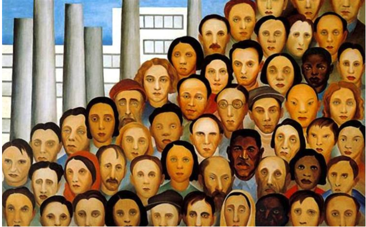
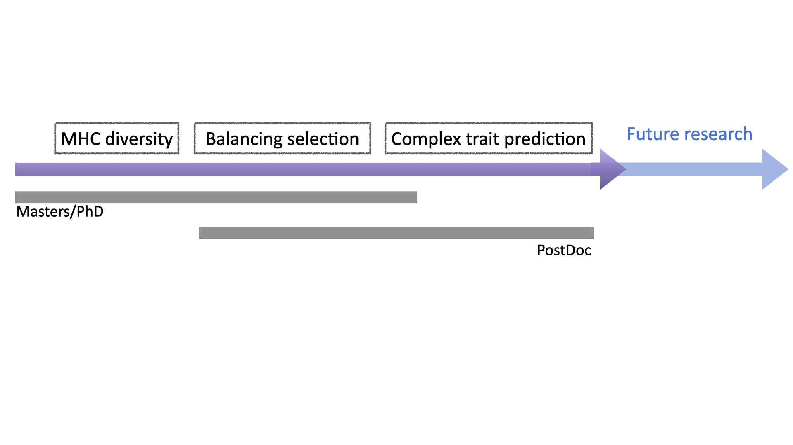
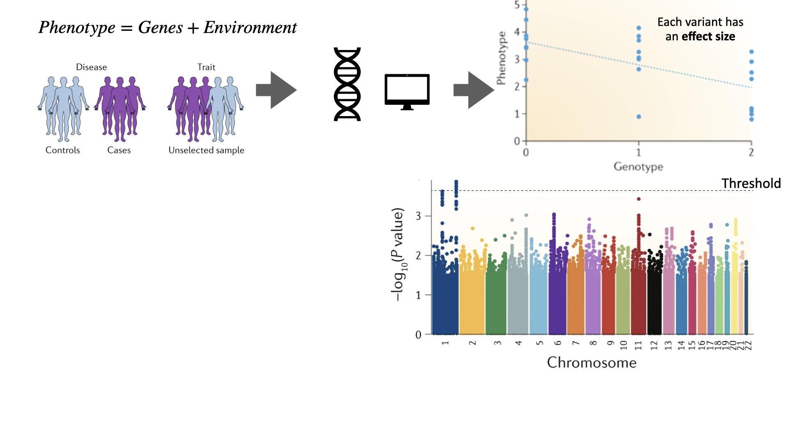
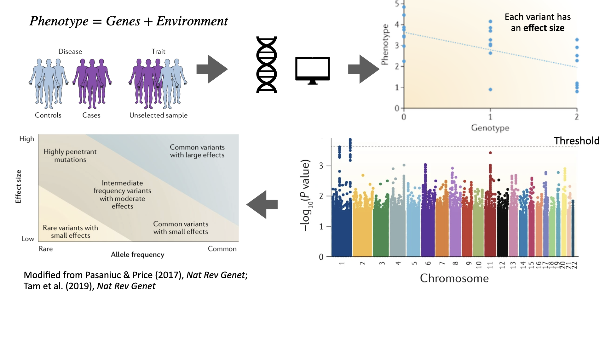
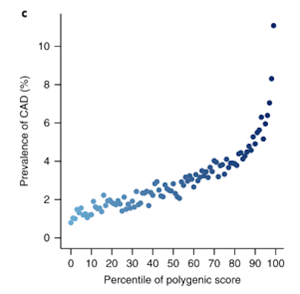
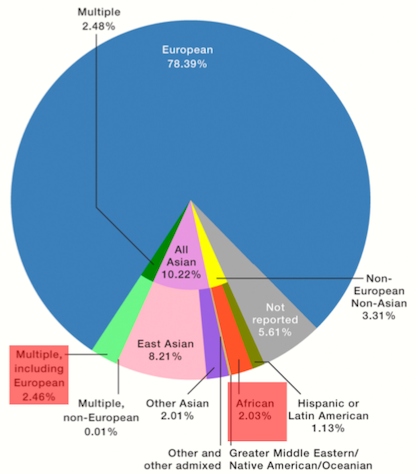
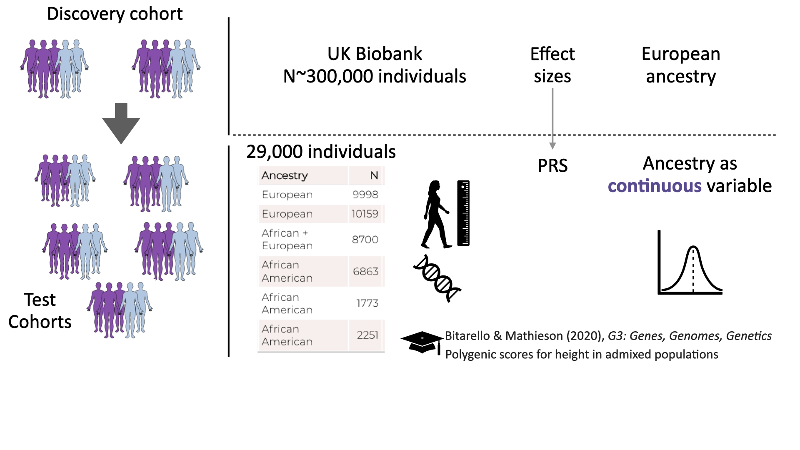
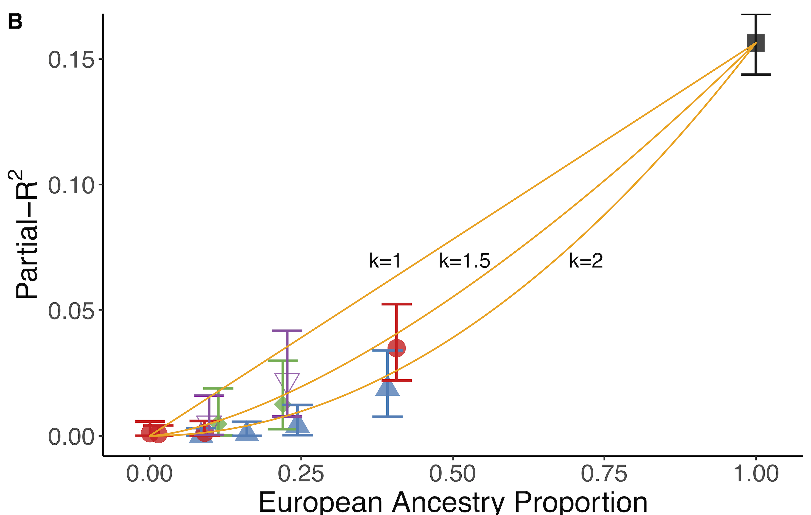
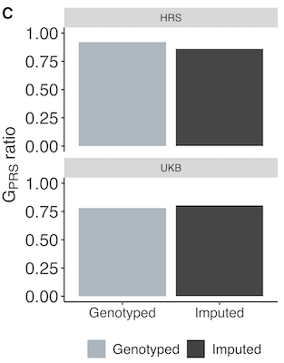

class: center, middle, inverse
```{r setup, include=FALSE}
options(htmltools.dir.version = FALSE)
library(knitr)
library(shiny)
library(ggplot2)
library(data.table)
library(scales)
library
library(xaringanExtra)
library(xaringanthemer)
knitr::opts_chunk$set(tidy = FALSE, eval = TRUE)
```
```{r xaringan-tile-view, echo=FALSE}
xaringanExtra::use_tile_view()
xaringanExtra::use_broadcast()
#xaringanExtra::use_animate_all("slide_left")
xaringanExtra::use_animate_css()
xaringanExtra::use_progress_bar(color="#D9D0D3", location="bottom")
```

```{r xaringan-themer, include=FALSE, warning=FALSE}


wes_palettes <- unname(unlist(list(
  BottleRocket1 = c("#A42820", "#5F5647", "#9B110E", "#3F5151", "#4E2A1E", "#550307", "#0C1707"),
  BottleRocket2 = c("#FAD510", "#CB2314", "#273046", "#354823", "#1E1E1E"),
  Rushmore1 = c("#E1BD6D", "#EABE94", "#0B775E", "#35274A" ,"#F2300F"),
  Rushmore = c("#E1BD6D", "#EABE94", "#0B775E", "#35274A" ,"#F2300F"),
  Royal1 = c("#899DA4", "#C93312", "#FAEFD1", "#DC863B"),
  Royal2 = c("#9A8822", "#F5CDB4", "#F8AFA8", "#FDDDA0", "#74A089"),
  Zissou1 = c("#3B9AB2", "#78B7C5", "#EBCC2A", "#E1AF00", "#F21A00"),
  Darjeeling1 = c("#FF0000", "#00A08A", "#F2AD00", "#F98400", "#5BBCD6"),
  Darjeeling2 = c("#ECCBAE", "#046C9A", "#D69C4E", "#ABDDDE", "#000000"),
  Chevalier1 = c("#446455", "#FDD262", "#D3DDDC", "#C7B19C"),
  FantasticFox1 = c("#DD8D29", "#E2D200", "#46ACC8", "#E58601", "#B40F20"),
  Moonrise1 = c("#F3DF6C", "#CEAB07", "#D5D5D3", "#24281A"),
  Moonrise2 = c("#798E87", "#C27D38", "#CCC591", "#29211F"),
  Moonrise3 = c("#85D4E3", "#F4B5BD", "#9C964A", "#CDC08C", "#FAD77B"),
  Cavalcanti1 = c("#D8B70A", "#02401B", "#A2A475", "#81A88D", "#972D15"),
  GrandBudapest1 = c("#F1BB7B", "#FD6467", "#5B1A18", "#D67236"),
  GrandBudapest2 = c("#E6A0C4", "#C6CDF7", "#D8A499", "#7294D4"),
  IsleofDogs1 = c("#9986A5", "#79402E", "#CCBA72", "#0F0D0E", "#D9D0D3", "#8D8680"),
  IsleofDogs2 = c("#EAD3BF", "#AA9486", "#B6854D", "#39312F", "#1C1718")
)))

set.seed(2)
wes_cols<-sample(wes_palettes,5, replace=T)
# "#FAD77B" "#F2AD00" "#A42820" "#EBCC2A" "#8D8680"
wes_cols<-c("#046C9A","#E6A0C4", wes_cols, "#D8A499")
# Create a xaringan style in a temporary file
xaringan_themer_css <- tempfile("xaringan-themer-", fileext = ".css")

style_duo_accent(primary_color = wes_cols[1], 
          secondary_color = wes_cols[5],
          text_bold_color = wes_cols[6],
          black_color = wes_cols[3],
          title_slide_text_color = wes_cols[4],
          title_slide_background_color = wes_cols[8],
          inverse_background_color=wes_cols[7],
          base_font_size = "22px",
          text_font_size="1.2em",
          header_font_google = google_font("Josefin Sans"),
          text_font_google   = google_font("Montserrat", "300", "300i"),
          code_font_google   = google_font("Fira Mono"),
        colors = c(
  pink = "#E6A0C4",
  cornflowerblue = "#7294D4",
  weirdbrown = "#D8A499",
  darkbrown="#550307",
  lilac="#9986A5",
  gray="#8D8680",
  green="#78B7C5",
  orange="#F2AD00"
)
)

extra_css <- list(
  ".small" = list("font-size" = "90%"),
  ".Large" = list("font-size" = "120%"),
  ".LARGE" = list("font-size" = "160%"),
  ".full-width" = list(
    display = "flex",
    width   = "100%",
    flex    = "1 1 auto"
  ), 
  "nonfull-width" = list(
    display = "flex",
    width = "130%",
    flex    = "1 1 auto"
 )
)
#> Warning: Colors that will be used by `theme_xaringan()` need to be in hexadecimal format: text_color, inverse_text_color

# View the CSS:
# file.edit(xaringan_themer_css)


```
# Investigating the lack of transferability of polygenic risk scores in cohorts with admixed ancestry

**.darkbrown[Bárbara Domingues Bitarello]**

**.weirdbrown[Assistant Professor] | .weirdbrown[Bryn Mawr College]**

---
class: left, inverse

# Similar, but **different**

.right-column[
.
```{r, out.width = "720px",echo=FALSE, eval=T}

```
]
.left-column[
*"Operários"* 

Tarsila do Amaral (1933)

.footnote[wikiart.org]
]
---

class: center, top

# My research: an overview

```{r, out.width = "950px",echo=FALSE, eval=T}
knitr::include_graphics("meat/schemas/schemas.001.png")
```
---
class: left, top

# Big questions


- What **evolutionary processes** shape genetic diversity?

--

- What are some of the **most diverse** genetic systems known and **how** did they evolve?

--

- What are the **consequences** of genetic diversity and their link to common diseases?

--
- Can we **predict complex phenotypes** using genetics in an equitable way that encompasses **all** of human genetic diversity?

---
class: left, top
# My research trajectory

--
```{r, out.width = "1500px",echo=FALSE, eval=T}

```


---
class: left, top
# GWAS detect **genetic associations** to traits of interest

```{r, out.width = "975px",echo=FALSE, eval=T}
knitr::include_graphics("meat/schemas/schemas.031.png")
```
---
class: left, top
# GWAS detect **genetic associations** to traits of interest

```{r, out.width = "975px",echo=FALSE, eval=T}
knitr::include_graphics("meat/schemas/schemas.032.png")
```
---
class: left, top
# GWAS detect **genetic associations** to traits of interest

```{r, out.width = "975px",echo=FALSE, eval=T}

```
---
class: left, top
# GWAS detect **genetic associations** to traits of interest


```{r, out.width = "975px",echo=FALSE, eval=T}

```


---
class: middle, center, inverse

# .weirdbrown[Combined], these variants can explain .weirdbrown[a lot] of the phenotypic variance!


---
class: center, top

# Polygenic risk scores **combine all** associated variants for a trait

.pull-left[

.Large[$$PRS=\sum {\hat\beta G}$$]

$\hat\beta$ : effect size (from GWAS)

$G$ : Effect allele dosage


E.g. cardiovascular disease

Khera et al. (2018) *Nat Genet*
]

.pull-right[.full-width[

```{r, out.width = "425px",echo=FALSE, eval=T}

```
]]


---
class: middle, center, inverse

# What about **.weirdbrown[ancestry]**?


---
class: center, top
.pull-left[.full-width[
### **European ancestry** represents almost **80% of GWAS** participants

Sirugo et al. (2019), *Cell*]

```{r, out.width = "380px",echo=FALSE, eval=T}

```
]

--

.pull-right[.full-width[


```{r, out.width = "1700px",echo=FALSE, eval=T}
knitr::include_graphics("meat/schemas/schemas.041.png")
```

.small[https://worldpopulationreview.com/]

### ... and  **less than 15%** of the world's population]]


---
class: middle, center, inverse

# How does this affect .weirdbrown[phenotypic prediction]?

---
class: left, top
## **LOA** increases with genetic distance from Europeans

.pull-left[.full-width[
```{r, out.width = "690px",echo=FALSE, eval=T}
knitr::include_graphics("intro/Screen Shot 2020-09-16 at 10.26.28 PM.png")
```

.gray[Martin et al. (2019) *Nat Genet*]
]]
.pull-right[

**LOA:** loss-of-accuracy

- did not look at admixture

- average of 17 traits

- waht drives this?

]

---
class:middle, inverse, center

# Why?

---
class: top, center

# **Many factors** may influence  PRS .lilac[LOA]

--

.pull-left[.full-width[

causal variants
 
 

local selection


gene-gene interactions


gene-environment interactions
]]

--
.pull-right[.full-width[

effect sizes


genomic LD patterns


allele frequencies


phenotypic variance
]]

--
### **not** mutually exclusive!

---
class: middle, center, inverse

# What factors **actually** affect prediction accuracy?

--

# What can be done to **improve it**?

---
class: middle, left

.pull-left[
## What factors **actually** affect prediction accuracy?

--

**Approach:** verify how well we can predict a phenotype in different ancestry populations and investigate the causes for discordance

]

--


.pull-right[## What can be done to **improve it**?


**Approach:** explore approaches to mathematically correct for discordances
]

---
class: middle, center, inverse

# Let's look at **height**

---
class: top, center

# **Many factors** may influence  PRS .lilac[LOA]


.pull-left[.full-width[

.gray[causal variants]

.gray[local selection]

.gray[gene-gene interactions]

.gray[gene-environment interactions]
]]


.pull-right[.full-width[

.Large[marginal effect sizes]

.Large[genomic LD patterns]

.Large[allele frequencies]

.Large[phenotypic variance]
]]


### **not** mutually exclusive!
---
class:center, top
# Predicting .lilac[height] in individuals with .lilac[admixed ancestry]

```{r, out.width = "1000px",echo=FALSE, eval=T}
knitr::include_graphics("meat/schemas/schemas.035.png")
```

---
class:center, top
# Predicting .lilac[height] in individuals with .lilac[admixed ancestry]

```{r, out.width = "1000px",echo=FALSE, eval=T}

```

---
class:center, top
## Predictive power **increases** with genomic proportion of .lilac[European ancestry]
```{r, out.width = "1000px",echo=FALSE, eval=T}
knitr::include_graphics("meat/schemas/schemas.037.png")
```
???
Here we have the main finding. Explain this figure.
We then proceeded to investifate, one by one, the different methodological and statistical factors that could be driving this and concluded that there is no simply fix to this loss of prediction. That is, the fix would have to happen upstream, i.e, the discovery cohorts need to be more diverse. 
---
class:center, top
## Predictive power **increases** with genomic proportion of .lilac[European ancestry]

```{r, out.width = "1000px",echo=FALSE, eval=T}
knitr::include_graphics("meat/schemas/schemas.038.png")
```

class: middle, center, inverse

 **Why** is PRS accuracy a function of genomic proportion of .weirdbrown[European ancestry]?
???
We chose to look at height because it is ahighly heritable trait, that is, it has a large genetic component.

---
class: top, left
##  .lilac[Surprisingly], this relationship seems to be .lilac[quadratic]

.pull-left[.full-width[
```{r, out.width = "670px",echo=FALSE, eval=T}

```

]]

.pull-right[.full-width[

$$y=0.15p_{eur}^k$$

$k=1$ 

all predictive power comes from European chunks


$k=2$

predictive power is uniformly distributed 

]]

But see Marnetto et al. (2020) *Nat Comms* for conflicting findings.

???
Using only EUR chunks of each genome
In both scenarios, mroe Eur ancestry means more data, so of course prediction increases, but while kappa=1 entails that it is the EUr chunks themselves that contribute to this, kappa=2 entails that 
 On the other hand, if the predictive power were uniformly distributed across the EUR and AFR chunks of the genome, we would expect a quadratic relationship: the partial-R2 of the whole genome (which scales linearly with ancestry) would be multiplied by the proportion of the genome in European ancestry segments (i.e., ancestry). Our observations are intermediate to these extremes (Figure 1B). We conclude that the predictive power of the PRS is enriched in, but does not entirely come from, the European ancestry segments of the admixed genomes, suggesting that the ancestry-specific interactions might play a role.
 
 : Using only European ancestry segments.
The orange lines represent the equation y ¼ 0:15pk
eur, for k={1,1.5,2}. k
= 1 and k = 2 represent the extreme cases where the predictive power
in admixed individuals comes entirely from European ancestry segments of the genomes (k = 1) or is uniformly distributed across the
whole genome (k = 2).

We next restricted the PRS SNPs to those found in segments of the
genome inferred to have European ancestry (Figure 1B). If the
predictive power of the PRS came entirely from these segments, then
we would expect the relationship between ancestry and partial-R2 to
be the same as when we used the whole genome (i.e., linear as in
Figure 1A). On the other hand, if the predictive power were uniformly
distributed across the genome, we would expect a quadratic relationship: the partial-R2 of the whole genome (which scales linearly with
ancestry) would be multiplied by the proportion of the genome in
European ancestry segments (i.e., ancestry). Our observations are
intermediate to these extremes (Figure 1B). We conclude that the
predictive power of the PRS is enriched in, but does not entirely come
from, the European ancestry segments of the admixed genomes,
suggesting that the ancestry-specific interactions might play a role.
---
class: top, left
## **Allele frequencies** explain up to **20%** of LOA

.pull-left[.full-width[
```{r, out.width = "370px",echo=FALSE, eval=T}

```
]]

.pull-right[.full-width[

**.green[Additive genetic variance]**


$$G_{PRS}=\frac{\sum2f_{i_afr}(1-f_{i, afr})\beta_{i,eur}^2}{\sum2f_{i,eur}(1-f_{i,eur})\beta_{i,eur}^2}$$

Bitarello & Mathieson (2020), *G3: Genes, Genomes, Genetics*
]]

---
class: top, center
## Phenotypic variance **does not** change with ancestry

.pull-left[.full-width[

genome-wide genetic variance in EUR is $\sim 76\%$ of that in AFR

$$height\sim Sex+Age+ Age^2+p_{eur}$$
.gray[Mean+1 1sd, constant variance]

.orange[Phenotypic variance is 100% in AFR and 76% in EUR]

$$y=\mu+\beta p_{j, eur}+\epsilon; \epsilon_{j}\sim N(0,\delta ^2  + \gamma p_{j, eur})$$

.green[fitted, variable variance]
]]

.pull-right[.full-width[
```{r, out.width = "390px",echo=FALSE, eval=T}
knitr::include_graphics("intro/FigureS13.png")
```

Bitarello & Mathieson (2020),*G3*
]]


???
We combined all 29,746 individuals (Table 1, UKB_eur excluded)
and computed the residuals yi of the regression of height on sex,
dataset, age, age2
, sexdataset, sexage, sexage2
, datasetage, datasetage2
. We then fitted a linear model for residual height as a
function of the ancestry of individual j  and allowed the
variance to vary linearly with ancestry.

Gray lines show mean height, and dashed lines show ∓1 sd. In orange, we show the expected sd if it were negatively dependent on European ancestry. In green, we show the fitted model with variable variance, which is not significantly different from the constant variance model (gray). We reject the model (orange line) whereby the phenotypic variance in people with 100% European ancestry is 76% that of people with 0% European ancestry.
---
class: top, center
# Differences in linkage disequilibrium

```{r, out.width = "670px",echo=FALSE, eval=T}
knitr::include_graphics("intro/LD_SCHEMA.png")
```


---
class: top, left
## **Prediction 1:** better tagging of causal variants decreases .lilac[LOA]
--

```{r, out.width = "570px",echo=FALSE, eval=T}
knitr::include_graphics("intro/Fig4a.png")
```

[Bitarello & Mathieson (2020), *G3*]

.pull-right[**Observation:** Imputation .weirdbrown[does not] influence .weirdbrown[LOA]
]
---
class: top, left
### **Prediction 2:** LOA is .weirdbrown[independent] of LD differences

$$Rel_{R2}=\frac{R^2_{bin}}{R^2_{total}}$$

.pull-left[.full-width[
```{r, out.width = "700px",echo=FALSE, eval=T}
knitr::include_graphics("intro/LD_cartoon.001.jpeg")
```
]]
.pull-right[.full-width[
```{r, out.width = "700px",echo=FALSE, eval=T}
knitr::include_graphics("intro/LD_cartoon.002.jpeg")
```
]]
###**Similar** slopes

---
class: top, left
### **Prediction 3:** LOA is .weirdbrown[dependent] of LD differences

$$Rel_{R2}=\frac{R^2_{bin}}{R^2_{total}}$$

.pull-left[.full-width[
```{r, out.width = "600px",echo=FALSE, eval=T}
knitr::include_graphics("intro/LD_cartoon2.001.jpeg")
```
]]
.pull-right[.full-width[
```{r, out.width = "600px",echo=FALSE, eval=T}
knitr::include_graphics("intro/LD_cartoon2.002.jpeg")
```
]]
###**Different** slopes
???
If LD differences between African and European haplotypes drive
the pattern seen in Figure 1, then a PRS constructed from SNPs in low
recombination regions should be more transferable than a PRS
constructed from SNPs in high recombination regions of the genome
---
class: top, center

### **Observation:** LOA is *somewhat* dependent on recombination rate

.left-column[

$$Rel_{R2}=\frac{R^2_{bin}}{R^2_{total}}$$

```{r, out.width = "100px",echo=FALSE, eval=T}
knitr::include_graphics("intro/legend.png")
```
.footnote[Bitarello & Mathieson (2020), *G3*]
]

.right-column[

```{r, out.width = "500px",echo=FALSE, eval=T}
knitr::include_graphics("intro/Fig3b.png")
```
### Recombination Rate
]

???
On the
other hand, we note that, even for the quartile of lowest recombination, the reduction in partial-R2 for admixed individuals is substantial – 76% on average across datasets – compared to 84% for the
fourth quantile (Figure 3A). Thus, even if all PRS variants were from
low recombination regions, we would still observe a substantial
reduction in predictive power.
---
class: top, center
### Differences in effect sizes .weirdbrown[increase] with .weirdbrown[allele frequency differences]

.pull-left[.full-width[

$y=sex+age+age^2+10PCs$

$N_{AFR}\sim8,800; N_{EUR}\sim350,000$

```{r, out.width = "450px",echo=FALSE, eval=T}
knitr::include_graphics("intro/Fig3c.png")
```

]]


.pull-left[.full-width[

$$\chi_{diff}^2=\left[\frac{\beta_{eur}-\beta_{afr}}{\sqrt{SE_{eur}^2+SE_{afr}^2}}\right]^2$$

```{r, out.width = "440px",echo=FALSE, eval=T}
knitr::include_graphics("intro/Fig5b.png")
```
]]

.pull-center[
Bitarello & Mathieson (2020), *G3: Genes, Genomes, Genetics*
]


???
We calculated allele frequencies for all variants in the HRS_afr and
HRS_eur subsets separately. We defined 10 Kb windows around each
PRS SNP and calculated the mean squared frequency difference
between subsets for all the SNPs contained in the window. We
explore the effect size difference for AFR and EUR (Equation 1)
for each PRS SNP as a function of the mean squared frequency
difference in the window surrounding each SNP.

Differences in marginal effect size
The marginal effect size at a PRS SNP depends on the cumulative effects
of the causal variants that it tags. Therefore, marginal effect sizes at PRS
variants across ancestries might differ for several reasons, including
local epistasis or allelic heterogeneity. When we ignore effect sizes and
calculate the unweighted PRS, we see a similar pattern to Figure 1A
(Figure 5A), suggesting that not only marginal effect sizes but even
directions differ between ancestries. That we can improve the predictive
power of PRS by including effect sizes re-estimated in African ancestry
populations (Figure 2) also indirectly supports the role of effect size
differences. Finally, we find that allele frequencies differ more between
African and European populations around SNPs with larger effect size
differences, although the effect is rather small (r = 0.0005; P = 0.0327;
Figure 5B, Figure S13). These results suggest that marginal effect sizes
differ across ancestries and that this is one of the factors underlying the
reduction in predictive power.

---
## **Assuming** there are differences in marginal effect sizes

$$PRS_1^{C}=\alpha PRS_{AFR}+(1-\alpha) PRS_{EUR}$$
Marquez-Luna *et al.* (2018) *Genet Epidem*

--

$$PRS_2^{C}=\alpha(1-p_{eur,j}) PRS_{afr,j}+(1-\alpha+\alpha p_{eur,j}) PRS_{EUR}$$
Bitarello & Mathieson (2020), *G3: Genes, Genomes, Genetics*
--

$$PRS_3^{C}= \alpha\left[\sum_{i\in AFR}\beta_{i, afr} G_{i}\right]+(1-\alpha)\left[\sum_{i\in AFR}\beta_{i, eur} G_{i}\right]+\left[\sum_{i\in EUR}\beta_{i, eur} G_{i}\right]$$
Bitarello & Mathieson (2020), *G3: Genes, Genomes, Genetics*
---
class:left
###**Prediction:** ancestry-specific effect sizes improve accuracy for admixed individuals

.center[
```{r, out.width = "590px",echo=FALSE, eval=T}
knitr::include_graphics("intro/Fig2.png")
```

Bitarello & Mathieson (2020), *G3*
]

**Observation:** Modest improvement 

---

# In summary

* PRS have little/no utility for ancestries **other than European**

* Many factors; need to **diversify genetic studies** at all stages

* optimizing **ancestry-sensitive** approaches

* make **LD reference panels** available for diverse ancestries

* explore ancestry-dependent **gene-gene** interactions

* explore population-specific **gene-environment** interactions


---
class: top, center
# Acknowledgements

.pull-left[.full-width[

### .weirdbrown[Iain Mathieson - UPenn]

Arslan Zaidi

Dan Ju

Samantha Cox

Laura Colbran

Shweta Ramdas

]]

.pull-right[.full-width[
Neale Lab

UK Biobank

Women's Health Initiative

Jackson Heart Study

Health and Retirement Study

Upenn Biobank

1000 Genomes Project
]]

---
class: top, center, inverse
# Perguntas?

.pull-left[
.left[
### Onde me encontrar

<a href="mailto:bbitarello@brynmawr.edu"><i class="fa fa-paper-plane fa-fw"></i>&nbsp; bbitarello@brynmawr.edu</a><br>
<a href="https://bbitarello.github.io"><i class="fa fa-link fa-fw"></i>&nbsp; bbitarello.github.io</a><br>
<a href="http://twitter.com/dudutchy"><i class="fa fa-twitter fa-fw"></i>&nbsp; @dudutchy</a><br>
<a href="http://github.com/bbitarello"><i class="fa fa-github fa-fw"></i>&nbsp; @bbitarello</a><br>
]]

.pull-right[
```{r, out.width = "160px",echo=FALSE, eval=T}
knitr::include_graphics("meat/rmarkdown.jpeg")
```

```{r, out.width = "190px",echo=FALSE, eval=T}

```
]


