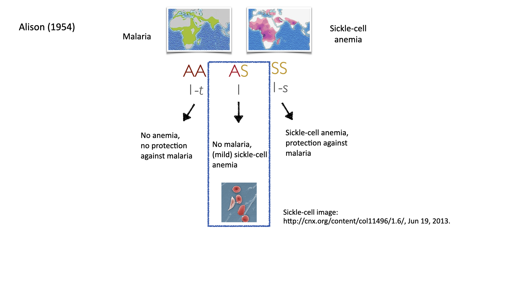

class: center, middle
<style>
.remark-slide-number {
  position: inherit;
}

.remark-slide-number .progress-bar-container {
  position: absolute;
  bottom: 0;
  height: 4px;
  display: block;
  left: 0;
  right: 0;
}

.remark-slide-number .progress-bar {
  height: 100%;
  background-color: gray;
}
</style>

```{r setup, include=FALSE}
options(htmltools.dir.version = FALSE)
library(knitr)
library(shiny)
library(ggplot2)
library(data.table)
library(scales)
library(xaringanExtra)
knitr::opts_chunk$set(tidy = FALSE, eval = TRUE)
```
```{r xaringan-tile-view, echo=FALSE}
xaringanExtra::use_tile_view()
xaringanExtra::use_broadcast()
#xaringanExtra::use_animate_all("slide_left")
xaringanExtra::use_animate_css()
```

```{r xaringan-themer, include=FALSE, warning=FALSE}
library(xaringanthemer)
#xaringanthemer::style_duo_accent(primary_color = "#D8A499",secondary_color = "#7294D4")
wes_palettes <- list(
  BottleRocket1 = c("#A42820", "#5F5647", "#9B110E", "#3F5151", "#4E2A1E", "#550307", "#0C1707"),
  BottleRocket2 = c("#FAD510", "#CB2314", "#273046", "#354823", "#1E1E1E"),
  Rushmore1 = c("#E1BD6D", "#EABE94", "#0B775E", "#35274A" ,"#F2300F"),
  Rushmore = c("#E1BD6D", "#EABE94", "#0B775E", "#35274A" ,"#F2300F"),
  Royal1 = c("#899DA4", "#C93312", "#FAEFD1", "#DC863B"),
  Royal2 = c("#9A8822", "#F5CDB4", "#F8AFA8", "#FDDDA0", "#74A089"),
  Zissou1 = c("#3B9AB2", "#78B7C5", "#EBCC2A", "#E1AF00", "#F21A00"),
  Darjeeling1 = c("#FF0000", "#00A08A", "#F2AD00", "#F98400", "#5BBCD6"),
  Darjeeling2 = c("#ECCBAE", "#046C9A", "#D69C4E", "#ABDDDE", "#000000"),
  Chevalier1 = c("#446455", "#FDD262", "#D3DDDC", "#C7B19C"),
  FantasticFox1 = c("#DD8D29", "#E2D200", "#46ACC8", "#E58601", "#B40F20"),
  Moonrise1 = c("#F3DF6C", "#CEAB07", "#D5D5D3", "#24281A"),
  Moonrise2 = c("#798E87", "#C27D38", "#CCC591", "#29211F"),
  Moonrise3 = c("#85D4E3", "#F4B5BD", "#9C964A", "#CDC08C", "#FAD77B"),
  Cavalcanti1 = c("#D8B70A", "#02401B", "#A2A475", "#81A88D", "#972D15"),
  GrandBudapest1 = c("#F1BB7B", "#FD6467", "#5B1A18", "#D67236"),
  GrandBudapest2 = c("#E6A0C4", "#C6CDF7", "#D8A499", "#7294D4"),
  IsleofDogs1 = c("#9986A5", "#79402E", "#CCBA72", "#0F0D0E", "#D9D0D3", "#8D8680"),
  IsleofDogs2 = c("#EAD3BF", "#AA9486", "#B6854D", "#39312F", "#1C1718")
)

style_duo_accent(primary_color = "#7294D4", 
          secondary_color = "#D8A499",
          text_bold_color = "#E6A0C4",
          title_slide_text_color = "#C6CDF7",
          title_slide_background_color = "#D8A499",
          text_font_size=2,
          header_font_google = google_font("Josefin Sans"),
          text_font_google   = google_font("Montserrat", "300", "300i"),
          code_font_google   = google_font("Fira Mono"),
          colors = c(
  pink = "#E6A0C4",
  cornflowerblue = "#7294D4",
  weirdbrown = "#D8A499",
  lilac="#C6CDF7",
  gray="#8D8680",
  green="#78B7C5",
  orange="#F2AD00"
)
)
extra_css <- list(
  ".small" = list("font-size" = "90%"),
  ".large" = list("font-size" = "120%"),
  ".LARGE" = list("font-size" = "150%"),
  ".full-width" = list(
    display = "flex",
    width   = "100%",
    flex    = "1 1 auto"
  )
)

```

# .pink[Evolutionary causes and clinical implications of genetic diversity]

### .lilac[Research Talk]

### .lilac[Bárbara Domingues Bitarello, Postdoctoral Scholar]

### .lilac[Perelmax School of Medicine, University of Pennsylvania]

???
Good afternoon everyone, my name is Bárbara and I am a postdoctoral scholar in the genetics department of the school of medicine at Upenn. I am excited to present my research to all of you today.
---
class: middle, center

## Similar, but different 
```{r, out.width = "780px",echo=FALSE, eval=T}
knitr::include_graphics("intro/tarsila.png")
```

*"Operários"*, Tarsila do Amaral (1933) [Source: www.wikiart.org]

???
A quick look around on the street, or at work, can make it clear that we, as a species, carry a lot of diversity. We differ in height, some diseases run in our families, some of us have asthama and can't see well, and so on.

Part of that diversity is rooted in genetics, while another part is due to the environment. Teasing those apart and understanding where diversity comes from is the central goal of population genetics. 
---
class: middle, left

## Big questions

### .pink[1)] How has .lilac[evolution] shaped genetic diversity?
???
In a sense, the main questions that drives my research interests have this common thread.p
--

### .pink[2)] What are some of the .lilac[most diverse genetic systems] known and .lilac[how] did they evolve?

???
What evolutionary processes shape genetic diversity
What examples do we have of extremely diverse systems and what do they tell us about selective pressures?
--

### .pink[3)] What are the .lilac[consequences of genetic diversity] and their link to common diseases?
???
Are these consequences to such diversity, i.e, the presence of 'common variants' that predispose us to disease? 
--

### .pink[4)] Can we .lilac[predict complex phenotypes] using genetics in an equitable way that encompasses all of human genetic diversity?

???
And, finally, since it seems inevitable that we are headed towards personalized genomic medicine, can it be done in a fair way?
---
class: middle, left

## .pink[Introduction]

## .lilac[Research Project 1]

## .lilac[Research Project 2]

## .lilac[Research Project 3]

## .lilac[Conclusions]

???
I will start off by giving an overview of some important concepts that are used throughout this presentation, followed by three stories I want to tell of how I addressed some of these questions. Finally, I will wrap it all up and talk about some exciting venues for my future research.
---
class: center, top
# My research: an overview
```{r, out.width = "970px",echo=FALSE, eval=T}
knitr::include_graphics("meat/schemas/schemas.001.png")
```

???
I use computational and statistics to approach much of these questions. I am a biologist with a PhD in evolutionary genetics, and, as such, a lot of my research involves a mix of comparative and population genomics. More recently, I have also embarked on a journey focused on biomedical applications and implications of findings from population genomics.
---
class: center, top
# My research: zooming in
```{r, out.width = "1200px",echo=FALSE, eval=T}
knitr::include_graphics("meat/schemas/schemas.002.png")
```

???
Zooming in a little bit, the three research topics I will be focusing on today will cover first the topic of MHC diversity, the most genetically diverse locus in the genomes of all vertebrates and an extreme case of balancing selection, followed by a project focused on balancing selection more broadly, and finally a project focused on  the power of genetic prediction pf phenotypes. 
---
class: center, top
# A polymorphism is .lilac[variable site] in the genome .lilac[across individuals]
```{r, out.width = "1000px",echo=FALSE, eval=T}
knitr::include_graphics("meat/schemas/schemas.004.png")
```


???
Every human individual carries 3.2 Billion 'letters' in their genome, and these carry the instructions for all the proteins as well as regulation of our genomes. 
For many of those positions, we are all the same. For some of those, however, we may find more than one variant, or allele, for a given locus. These variats arise by random mutations, and their fates will be governed by may evolutionary processes.  
---
class: center, top

## Genomic diversity in the .lilac[absense of selective pressures]
```{r, out.width = "1000px",echo=FALSE, eval=T}
knitr::include_graphics("meat/schemas/schemas.003.png")
```


???
Many sites in the genome evolve neutrally. Meaning that, even when a mutation arises, it has no appreciable consequence for the phenotype in a meaningful way. By meaningful I mean a way that affects the individuals fitness, that is, their reproductive success. 

For instance, when a new population is founded by a small number of individuals from a larger popualtion, there is a loss of genetic diversity by genetic drift.

Another example is admixture. When two populations from the same species, or even two related species, have different allele frequencies for many loci and they admix, the result is that more sites in the offsprings genome will be heterozygote, which is a measure of genetic diversity
---
class: center, top

## .lilac[Balancing selection] maintains diversity in populations
```{r, out.width = "1000px",echo=FALSE, eval=T}
knitr::include_graphics("meat/schemas/schemas.005.png")
```

???
In addition to neutral process, natural selection can also shape genetic variation in population. If we think of this image as a population with two variants one variant (orange), Typically, when a new mutation arises (purple) that is either highly advantageous or highly deleterious, it will quickly and efficiently be targeted by natural selection, and that will result in reduced diversity, meaning that one variant will remain. 

On the other hand, another type of natural selection, BALANCING SELECTION, will actually maintain both of these hypothetical variants segregating because there is an adaptive tradeoff in doing so.
---
class: center, top

## Sometimes, it may be .lilac[beneficial] to harbour .lilac[deleterious variants]

```{r, out.width = "1000px",echo=FALSE, eval=T}

```

???
What does this look like in practice? Let's take the classical example of sickle cell anemia. In the 1950s, it was documented that the regions of the world where malaria was endemic highly overlapped with those were sickle cell disease was prevalent. 
Alison and others found out that a genotype at a specific locus in the genome was behind this. the 'normal variant' made it so that red blood cells had their usual shape, which is healthy but also very susceptible to malaria infection. A mutant variant, on the other hand, represented by S here, made it so that blood cells had the form of a sickle, which causes a severe form of anemia, but as a sice product makes it really hard to be infected by  malaria. The intermediate or heterozygote phenotype, finally, gives some protection to malarial infection while only causing mild anemia, and this genotype harbours strong signatures of balancing selection.

this is very interesting. A detrimental variant (the S allele) is selectively maintained in populations where malaria is endemic.
---
class: middle, left
## .lilac[Introduction]

## .pink[Research Project 1: Heterozygote advantage in HLA genes]

## .lilac[Research Project 2: Balancing selection in the human genome]

## .lilac[Research Project 3: Polygenic scores in different populations]

## .lilac[Conclusions]

???

Ok, so Now that we've covered what a variant or a polymorphic site in the genome is, what balancing selection is, we can jump into some research questions

[8 minutes until here]
---
class: center, middle

### .pink[1)] How has .lilac[evolution] shaped genetic diversity?


### .pink[2)] What are some of the .lilac[most diverse genetic systems] known and .lilac[how] did they evolve?
???
Let's start by focusing on the most diverse region of the vertebrate genome: the MHC
---
class: center, top
## The MHC is the .lilac[most genetically diverse] region of the vertebrate genome

```{r, out.width = "950px",echo=FALSE, eval=T}
knitr::include_graphics("meat/schemas/schemas.006.png")
```
???

The major histocompatibility was first detected as the factor behind transplant rejection, hence the name 'histocompatibility'. The reason for this is that this rgion harbours many genes respnsible for the adaptive immune response, that is, the one that we lear, not the innate one. Early in life our immune systems learn to discriminate self from non-self, and the rejection of transplants from incompatible donors comes from one immune system recognizing another as an invader. In addition to modulalting our immune responses, then, the genes in this locus have negative links to disease,, including many auto-immune diseases like celiac disease and psoriasis, to infectious disease like HIV and hepatitis,  to other complex diseases like T2 diabetes.
There is a vast literature on how certain alleles in these genes confer higher resistance to certain types of infection.

---
class: center, top
## The MHC is an .lilac[extreme instance] of balancing selection

```{r, out.width = "1000px",echo=FALSE, eval=T}
knitr::include_graphics("meat/schemas/schemas.007.png")
```
???
So this is clearly a very interesting locus, both from an evolutionary standpoint, as well as a more applied, health perspective. It has been known for some time that these genes represent the strongest instance of balancing selection in humans, and there is a good mechanistic basis behind it. The MHC genes code for cell surface proteins that present a antigen to the bonafide immune cells, the T cells shown here on the left. On the middle we see a schematic of the MHC molecule binding an antigen. Take note that this grove here corresponds to the part of the MHC genes that is actually very genetically diverse. In the 70s, it was suggested that individuals that are heterozygote for HLA alleles would have higher fitness, since each allele codes for one of these chains in the molecule and a heterozygote would be able to present a wider array of antigens.

This is fascinating, because on the one hand, our immune sustems are evolving to better present antigens efficiently, while pathogens are evolving to evade our immune systems. This is behind the diversity in these loci and why it is a good exaple of host-pathogen arms race or red queen hypothesis. In alice in wonderland, the red queen effect, which proposes that species must constantly adapt, evolve, and proliferate in order to survive while pitted against ever-evolving opposing species. 
---
class: center, middle

# Do .lilac[all heterozygotes] have the same fitness?

# Is there support for the .lilac[divergent allele advantage model?]

???
This makes complete sense. A question that motivated me was whether all heterozygotes are equally adaptive. 
---
class:  middle, left

## Is there support for the .lilac[divergent allele advantage model?]

#### .pink[Hypothesis:] divergent allele advantage model (heterozygote advantage is greater for genotypes with more divergent alleles) explains selective patterns in the HLA genes

#### .pink[Prediction:] increased signatures of balancing selection between pairs of HLA alleles that match different antigens
???
In other words, is there support for a model where heterozygotes composed of alleles that present a different antigen repertoire from each other more adaptive?
---
class: center, top
### To answer these questions, I looked at the human class I HLA genes

```{r, out.width = "1200px",echo=FALSE, eval=T}
knitr::include_graphics("meat/schemas/schemas.008.png")
```

???
To answer this, I looked at the three class I classical genes: HLA-A, HLA-B, HLA-C. Each one of those have thousands of different alleles described in a heavily curated immunogenetics database, and that number keeps increasing. The first step consisted in gathering the data and splitting these genes into ARS - the portions in the genome where the antigen binding sites are located - and the non-ARS - the rest of the gene. The latter were used as controls.

Now, HLA alleles are related to each other genealogically, like any other DNA sequences. Some of them are more closely related then others, and they are normally described either as supertypes (groups of alleles that present smilar sets of antigens) or allelic lineages (clades of alleles). For example this tree here is a subset of the allelic lineages for HLA-B. 

The next step was to use phylogenetic methods for hypothesis testing. The main hypothesis I tested was whether balancing selection was stronger in the branches that separate lineages than within lineages themselves. 

What I observed is that 

1) the evidence for selection is stronger between lineages, supporting the divergent allele advantage model and

2) the evidence for selection is also significant within lineages, meaning that it is also important, even if less so.
---
class: middle, left

## .lilac[Introduction]

## .lilac[Research Project 1: Heterozygote advantage in HLA genes]

## .pink[Research Project 2: Balancing selection in the human genome]

## .lilac[Research Project 3: Polygenic scores in different populations]

## .lilac[Conclusions]

???
The MHC/HLA system is certainly very interesting and unique, but it led me to other questions, and that's a good way to introduce my next research project


[16 minutes until here]
---

class: center, middle


# .lilac[How prevalent] has balancing selection been throughout human evolution? 

# What are the instances .lilac[beyond the MHC] loci?

???
What were the other isnances of balancing selection in our evolution beyong the MHC and how prevalent has this evolutionary process been?
---
class:top, left

### Can we devise a statistical test specific for signatures of balancing selection?

#### .pink[Approach:] combine independent signatures into one statistic
???
For starters this was hard to quantify because, unlike positive selection, balancing selection had not received a lot of attention in the literature, and most statistical tests used to detect it were not very specific

--

### If so, how prevalent has it been throughout human evolution?

#### .pink[Approach:] perform a genome-wide scan using a test specifically tailored for balancing selection

???
So we conjectured that by first designing a specific test for abalncing selection and then applying it to real data we would get a more complete picture

--

### Are there commn trends amongst the candidate regions/genes?

#### .pink[Approach:] Explore candidate regions/genes for common functions/patterns

???
Having used this statistic to search the genome, what can we say about the candidate targets of balancing selection in humans?
---
class:left, top

### Balancing selection results in .lilac[increased proportions] of polymorphic sites and .lilac[intermediate frequency] alleles

```{r, out.width = "930px",echo=FALSE, eval=T}
knitr::include_graphics("meat/schemas/schemas.009.png")
```
???
These two trees show alleles segregating under neutral evolution and under balancing selection, and the arrow goes from the past to the present. Due to drift, neutral alleles have an expected time span before they fixate or get lost, shown in gray. A locus under balancing selection, on the other hand, will actively keep two or more variants segregating in a locus for a longer time than expected under neutral evolution.|This fact results in two characteristic signatures: 1) a higher proportion of intermediate frquency alleles, which is shown by the blue and red alleles in the tree; and 2) a higher proportion of polymorphisms (controlled by the underlying mutation rate) than a typical neutrally evolving region of the genome. So my idea in this project was to combine both of these signatures into one statistics.
---
class:left, top
## A statistical test .lilac[specifically] tailored for .lilac[balancing selection?]
```{r, out.width = "1100px",echo=FALSE, eval=T}
knitr::include_graphics("meat/schemas/schemas.010.png")
```

???
Once I did that, the first step was to assess if this statistically actually worked. To do that, I simulated DNA sequences evolving under no selective pressure (i.e neutrally) and sequences where a locus is under balancing selection with different strengths. Both of these sequences were simulated 1000s of times under a model of human drmographic history so that genetic drift, bottlenecks etc cna be taken into account.Step 2 then involved calculating our new statistic (NCD2) for both sets of sequences and asking if they were sufficiently different to allow discrimination into these two categories. And indeed they were. Moreovoer, they had more power to detect balancing selection and ran more efficiently in computers than prev know methods.
---

### Pervasiveness and .lilac[targets] of balancing selection in humans

```{r, out.width = "1000px",echo=FALSE, eval=T}
knitr::include_graphics("meat/schemas/schemas.011.png")
```

???
So we verified that we had a powerful new test. We then applied it to real population genetics data from the 1000G project. In particular, we focused on populations from Africa and Europe. We then ran a genome-wide scan, defining windows of fixed size along the genome and calculating the statistic for each window. That results ina  distribution, awe wnd cutoffs can be defined either based on simulations (how unexpected?) or empirical (how uncommon). We used a mix of these two approaches and found that we were able to recriate most previous candidate genes in the literature, plus a number of novel, prev underscribed genes/regions. Among the most extreme outlier windows, there was a significantly higher proportion of protein-altering variants (compared to controls), a significantly higher thane xpected proportion of genes expressed preferentially in testis, an excess of immune genes (1/3 of total) as well as an excess of genes in 'defense' categories more broadly, including immunity but also skin barriers, bitter taste receptors etc

---
class: middle, left

## .lilac[Introduction]

## .lilac[Research Project 1: Heterozygote advantage in HLA genes]

## .lilac[Research Project 2: Balancing selection in the human genome]

## .pink[Research Project 3: Polygenic scores in different populations]

## .lilac[Conclusions]

???
This project made me very aware of how a given gene may be involved in many different processes and how balancing selection may play a role in explaining common diseases. This leads us to the final research story I am sharing today, which takes on a pretty different direction, focusing on biomedical data.

As hinted by this last slide, genetics is more complicated than simply 'good variants' get selected. Maladaptive variants can get fixated because of genetic drift, other variants can be good in certain situations but not others. So this is a good way to shift into the next topic of research, which revolves around disease risk prediction
---
class:center, top
##**Many** variants with **small** effect size

.pull-left[.full-width[
```{r, out.width = "600px",echo=FALSE, eval=T}
knitr::include_graphics("tam_et_al_2019_2.png")
```

Tam et al. (2019) *Nat Rev Genet*
]]

.pull-right[.full-width[

 .blue[Rare, monogenic diseases/traits:]
 
 phenylketonuria, sickle-cell anemia, Duchenne muscular dystrophia

.blue[complex, common diseases/traits:]

cardiovascular  disease, T2 diabetes, cancers, **height**, BMI
]]
???
A picture that has emerged from human genetics from a biomedical standpoint is that most genomic variants (or polymorphisms) that have a statistically significant association with a disease or trait are somewhat common (appreciable frequencies) and have a realtively small 'effect size'. On the other hand, what you may have learned as monogenic diseases/traits, such as muscualr distrofia

This results in the landscape of polygenic traits to look something like we see on the right: GWAS are mostly successful at capturing variants between these two diagonal lines: common, with moderate or small effect variants, and some rare but highly penetrant mutations, that is, that have a considerable effect size.
Rare variants with small effect sizes are difficult to identify using GWAS, and common variants with large effects are unusual for common complex diseases
---
class: inverse, middle, center

# .lilac[Combined, these variants can explain a lot!]

???

So you might be thinking this is bad news in terms of predicting outcomes. So although most of these variants we detect in genome-wide association studies have very small effect, when you add them up, they explain quite a lot of the variation in a trait. How, you may ask. let's rewind a bit.

---

class: center, top
### Genome-wide association studies .pink[(GWAS)] detect .pink[genetic associations] to traits of interest

```{r, out.width = "980px",echo=FALSE, eval=T}
knitr::include_graphics("meat/schemas/schemas.015.png")
```

???
Earlier I mentioned that there were genetic associations to autoimmune diseases in the MHC region. How are those associations detected?
GWAS are big scale studies. It works roughly like this: a trait of interest is chosen. Typically a binary trait such as presence or absence of disease status or a continuous trait, like height. A large cohort of individuals has their phenotype measured, and their genetic data analysed. Then, each variant is tested as shown in this plot on the right as to wehther it has an effect in the phenotype or not. In this fake example, depending on the genotype in this variant, the individual has remarkably different phenotypes. Next, each variant is represented in a plot such as this one, called a manhattan plot, where the peaks suggest the approx geneomic location of variants associated with the trait. Finally, the results from a gwas may be used in a so called polygenic score to asess the disease/phenotype status of a invidiaul outside the initial discovery cohort. 
---
class: center, top

## Polygenic risk scores combine .lilac[all variants] with an effect on the phenotype
.pull-left[.full-width[
```{r, out.width = "650px",echo=FALSE, eval=T}

knitr::include_graphics("gwas_schema_pasaniuc_price.png")
```

.small[Pasaniuc & Price (2017), *Nat Rev Genet*]


]]

.pull-right[.full-width[


$$PRS=\sum_{i=1}^{m} \hat\beta_{i} G_{j,i}$$ 


$\hat\beta$ : effect size (from GWAS)

$G$ : Effect allele dosage

$j$: Individuals

$i$: SNPs

**independence**

**additive model**

]]


???
So you did a GWAS for height. Then, for each variant in the genome you have something like this: the genotype in that locus has an effect on height, and can be modelled as a linear relationship. So you have an effect size for one allele in that locus, which is a correlation between the phenotype and the genotype. 

Then you make some assumptions about independence of these loci and that an additive model is appropriate and you have this polygenic score, which is a weighted sum of the genotypes in an individuals. Weighted by the effect sizes.
---
class: top, center
# PRSs are appealing


.pull-left[.full-width[
## **easy**

### **promising**

## **fast**

### **minimal requirements**
]]
.pull-right[.full-width[

#### Polygenic risk of cardiovascular disease
```{r, out.width = "400px",echo=FALSE, eval=T}
knitr::include_graphics("cad.png")
```

Khera et al. (2018), *Nat Genet*
]]

???
As a mentioned a few slides ago, a somehwat new approach is to combine the significant restuls from a GWAS into one single value, the polygenic score. The advantage is that althoguh each variatn has a small effect, overall they add up to substantial amounts of information.
So as you can see from this, PRS are very appealing...They are easy and simple to implement, all you need are some summary statistics from a GWAS, and no further complicated modeling.
Here is one promising example. The x axis shows the percentile of polygenic score. And the y axis shows the pravalence of CAD. IF we look at the highest bins of PRS, prevalance of CAD is 10%. These individuals have a 8-fold increase of CAD compared to the rest of the population. This makes the PRS able to find 20-fold mroe people at risk for CAD than if you were simply testing for large effect mutations, which have large effect but are rare.
There are a few other examples like this sofar for breast cancer for instance.
The main point I want to emphasize is...This is for individuals with European ancestry.

---
class: middle, center, inverse

# .lilac[What about ancestry?]

???
right. So what about ancestry?
---
class: center, top
.pull-left[.full-width[
## European **ancestry** represent almost 80% of GWAS participants...
```{r, out.width = "350px",echo=FALSE, eval=T}
knitr::include_graphics("Screen Shot 2020-09-16 at 4.28.04 PM.png")
```

Sirugo, Williams & Tishkoff (2019), *Cell*]]
--
.pull-left[.full-width[

```{r, echo=FALSE, eval=T, out.width = "420px"}
world<-fread('~/Downloads/csvData.csv')
#library(plotly)
blank_theme <- theme_minimal()+
  theme(
  axis.title.x = element_blank(),
  axis.title.y = element_blank(),
  panel.border = element_blank(),
  panel.grid=element_blank(),
  axis.ticks = element_blank(),
  plot.title=element_text(size=14, face="bold")
  )
bp<- ggplot(world, aes(x="", y=WorldPop, fill=Name))+
geom_bar(width = 1, stat = "identity") + coord_polar("y", start=0)+ 
  scale_fill_manual(values=c("red","#E6A0C4","#7294D4", "#999999","#899DA4","#A2A475")) + blank_theme +
  theme(axis.text.x=element_blank()) + 
  geom_text(aes(y=c(0.9,0.4,0.17, 0.10, 0.05, 0.025), label=paste0((c(0.1720, 0.5954, 0.0959, 0.0473,0.0055, 0.0553)*100), "%")), size=c(6,6,6,6,2,3))
 
print(bp)
```
```{r, out.width = "650px",echo=FALSE, eval=F}
knitr::include_graphics("Screen Shot 2020-09-16 at 2.44.43 PM.png")
```
[Data: https://worldpopulationreview.com/]

## .. and <15% of the world's population
]]

???
Ok, so let's look at this pie chart from last year, with the proportion of individuals from Each of these groups of ancestry that appear in GWAS. Europeans make up almost 80%, Asians about 20% and Africans about 2%. Note that this is a big improvement since 2009. The same survey in 2009 showed that 96% of individuals were European!

Anyway, now look at this pie chart on the right, which I made from data from worldpopulationreview for 2020. Now, the colors are not a true match, but I did my best. BEar in mind that the plot on the left is about ancestry, and the one on the right is about continents, regardless of ancestry. Nevertheless, it's a reasonable approximation for this purpose. Europeans in Blue represent a disproportionate amount of GWAS participants especially if you consider their share of the world's population. Asian POPULATION represent 60% of the world and ASIAN ANCESTRY only 10% of GWAS, and African POPULATION 17 and AND AFRICAN ANCESTRY 2%. Not to mention the other ancestries which are virtually non-existent.
---
class: center, top
### How much do polygenic scores predict phenotypes in .pink[other populations?]


```{r, out.width = "1000px",echo=FALSE, eval=T}
knitr::include_graphics("meat/schemas/schemas.019.png")
```


???
this is obviously not ideal and reflects many biases which I don't have time to go into to, but considering the hype i showed about PRS before, how does this affect popygenic risk score predictions?
Over the past two years or so a few papers have come out showing that prediction accuracy from PRS decreases with genetic distance from Europeans.
This figure from Martin et al showes average prediction accuracies for 17 traits, using GWAS summary statisticas derived from 100% European cohorts. I am not sure what american means?

---
class: middle, center


## How do these .lilac[different factors] affect prediction accuracy?


## What can we .lilac[do about it?]


???
So the questions that motivated this work were:
---
class: middle, left


## How do these different factors affect prediction accuracy?

#### .pink[Approach:] examine how well we can predict a highly heritable trait in different populations, based on an European ancestry discovery cohort and explore the roles of different biological/statistical factors

## What can we do about it?

#### .pink[Approach:] explore whether incorporating fine-scale ancestry information into these scores improves their performance

???
So the questions that motivated this work were:
---
class: middle, center

# .lilac[Let's look at] height
???
We chose to look at height in individuals with Eur, afr and admixed ancestry.
---
class:left, top
## Wow well can we predict a .lilac[highly heritable] trait?

```{r, out.width = "1000px",echo=FALSE, eval=T}
knitr::include_graphics("meat/schemas/schemas.017.png")
```


???
why height? It's a somehwat well-udnerstood trait. it's hgihly popygenic and easy to measure. It is highly heritable (80% based ont twin studies, about 50% based on SNP heritability)

So in this work we used GWAS summary statistics for height from a cohort of 360K europeans from the UK biobank. And we verified how well we could predicti height in individuals with different degrees of african ancestry.

Importantly, unlike most studies, we consdierted ancestry as a continuous variable. So each individuals we analysed had a "proportion of Eur ancestry" inferred by local ancestry inference and averaged across the genome.

In the end we looked at about 19,000 individuals with admied ancestry, and 10,000 with eur ancestry from different cohorts.

we modell height as a function of sex age and eur ancesty and compare that to a mdoel that also includes prs.
---
class:left, top
## Wow well can we predict a .lilac[highly heritable] trait in .lilac[different populations?]
```{r, out.width = "1000px",echo=FALSE, eval=T}
knitr::include_graphics("meat/schemas/schemas.018.png")
```

---
class:left, middle


## 1. .lilac[Introduction]

## 2. .lilac[Research Theme 1: Balancing selection in humans]

## 3. .lilac[Research Theme 2: Polygenic risk prediction for individuals with non-European ancestry] 

## 4. .pink[Conclusions & Future Directions]
---
class: left, middle


### .pink[How has balancing selection shaped diversity in the HLA loci?]


### .pink[How prevalent has balancing selection been throughout evolution and what are the common trends?]


### .pink[How useful are polygenic risk predictors for individuals with non-European ancestries?]


---
class: middle, left


### .pink[1)] There is support for the .blue[divergent allele advantage model] in HLA evolution


### .pink[2)] A novel test, specifc for balancing selection, revealed many new candidates, 1/3 of which are immune-related, and many others related to defense broadly and reproduction


### .pink[3)] At present, PRS approaches have little to no utility for individuals with non-European ancestry, many factors are responsible, need to diversify genetics studies at all stages

---
class:left, top
```{r, out.width = "1000px",echo=FALSE, eval=T}
knitr::include_graphics("meat/schemas/schemas.012.png")
```
---
class: center, top
## Research Axis I: Balancing selection as a force that shapes diversity

```{r, out.width = "1000px",echo=FALSE, eval=T}
knitr::include_graphics("meat/schemas/schemas.014.png")
```
---
class: center, top
## Research Axis II: Polygenic risk prediction in admixed populations

```{r, out.width = "930px",echo=FALSE, eval=T}
knitr::include_graphics("meat/schemas/schemas.013.png")
```
---
class: top, center
# Acknowledgements

.pull-left[.full-width[

**Iain Mathieson**

**Diogo Meyer**

**Aida Andrés**

Joshua Schmidt

Cesare de Filippo

Rodrigo dos Santos Francisco

Débora Brandt

]]

.pull-right[.full-width[
Neale Lab

UK Biobank

Women's Health Initiative

Jackson Heart Study

Health and Retirement Study

1000 Genomes Project
]]


```{r, out.width = "300px",echo=FALSE, eval=T}
knitr::include_graphics("fapesp-logo.jpg")
```


---

class: inverse,center, middle

# .lilac[Thank you!]

# .lilac[Questions?]


