class: center, middle
<style>
.remark-slide-number {
  position: inherit;
}

.remark-slide-number .progress-bar-container {
  position: absolute;
  bottom: 0;
  height: 4px;
  display: block;
  left: 0;
  right: 0;
}

.remark-slide-number .progress-bar {
  height: 100%;
  background-color: gray;
}
</style>

```{r setup, include=FALSE}
options(htmltools.dir.version = FALSE)
library(knitr)
library(shiny)
library(ggplot2)
library(data.table)
library(scales)
library(xaringanExtra)
knitr::opts_chunk$set(tidy = FALSE, eval = TRUE)
```
```{r xaringan-tile-view, echo=FALSE}
xaringanExtra::use_tile_view()
xaringanExtra::use_broadcast()
#xaringanExtra::use_animate_all("slide_left")
xaringanExtra::use_animate_css()
```

```{r xaringan-themer, include=FALSE, warning=FALSE}
library(xaringanthemer)
#xaringanthemer::style_duo_accent(primary_color = "#D8A499",secondary_color = "#7294D4")
wes_palettes <- list(
  BottleRocket1 = c("#A42820", "#5F5647", "#9B110E", "#3F5151", "#4E2A1E", "#550307", "#0C1707"),
  BottleRocket2 = c("#FAD510", "#CB2314", "#273046", "#354823", "#1E1E1E"),
  Rushmore1 = c("#E1BD6D", "#EABE94", "#0B775E", "#35274A" ,"#F2300F"),
  Rushmore = c("#E1BD6D", "#EABE94", "#0B775E", "#35274A" ,"#F2300F"),
  Royal1 = c("#899DA4", "#C93312", "#FAEFD1", "#DC863B"),
  Royal2 = c("#9A8822", "#F5CDB4", "#F8AFA8", "#FDDDA0", "#74A089"),
  Zissou1 = c("#3B9AB2", "#78B7C5", "#EBCC2A", "#E1AF00", "#F21A00"),
  Darjeeling1 = c("#FF0000", "#00A08A", "#F2AD00", "#F98400", "#5BBCD6"),
  Darjeeling2 = c("#ECCBAE", "#046C9A", "#D69C4E", "#ABDDDE", "#000000"),
  Chevalier1 = c("#446455", "#FDD262", "#D3DDDC", "#C7B19C"),
  FantasticFox1 = c("#DD8D29", "#E2D200", "#46ACC8", "#E58601", "#B40F20"),
  Moonrise1 = c("#F3DF6C", "#CEAB07", "#D5D5D3", "#24281A"),
  Moonrise2 = c("#798E87", "#C27D38", "#CCC591", "#29211F"),
  Moonrise3 = c("#85D4E3", "#F4B5BD", "#9C964A", "#CDC08C", "#FAD77B"),
  Cavalcanti1 = c("#D8B70A", "#02401B", "#A2A475", "#81A88D", "#972D15"),
  GrandBudapest1 = c("#F1BB7B", "#FD6467", "#5B1A18", "#D67236"),
  GrandBudapest2 = c("#E6A0C4", "#C6CDF7", "#D8A499", "#7294D4"),
  IsleofDogs1 = c("#9986A5", "#79402E", "#CCBA72", "#0F0D0E", "#D9D0D3", "#8D8680"),
  IsleofDogs2 = c("#EAD3BF", "#AA9486", "#B6854D", "#39312F", "#1C1718")
)

style_duo_accent(primary_color = "#7294D4", 
          secondary_color = "#D8A499",
          text_bold_color = "#E6A0C4",
          title_slide_text_color = "#C6CDF7",
          title_slide_background_color = "#D8A499",
          text_font_size=2,
          header_font_google = google_font("Josefin Sans"),
          text_font_google   = google_font("Montserrat", "300", "300i"),
          code_font_google   = google_font("Fira Mono"),
          colors = c(
  pink = "#E6A0C4",
  cornflowerblue = "#7294D4",
  weirdbrown = "#D8A499",
  lilac="#C6CDF7",
  gray="#8D8680",
  green="#78B7C5",
  orange="#F2AD00"
)
)
extra_css <- list(
  ".small" = list("font-size" = "90%"),
  ".large" = list("font-size" = "120%"),
  ".LARGE" = list("font-size" = "150%"),
  ".full-width" = list(
    display = "flex",
    width   = "100%",
    flex    = "1 1 auto"
  )
)

```

# .pink[Evolutionary causes and clinical implications of genetic diversity]

### .lilac[Research Talk]

### .lilac[Bárbara Domingues Bitarello, Postdoctoral Scholar]

### .lilac[Perelman School of Medicine, University of Pennsylvania]
---
class: middle, left

## .lilac[Introduction]

## .pink[Research Project 1]

## .pink[Research Project 2]

## .pink[Research Project 3]

## .pink[Conclusions & Future Directions]

---
class: center, top
# My research: an overview
```{r, out.width = "970px",echo=FALSE, eval=T}
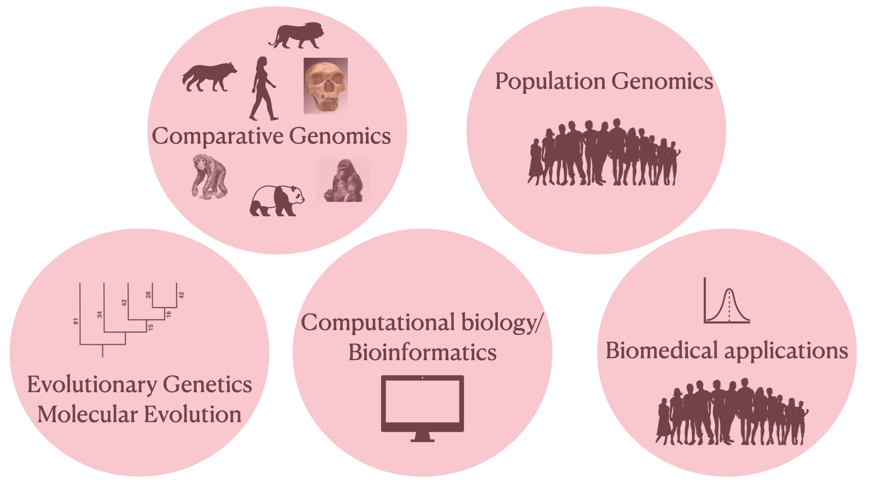
```

---
class: center, top
# My research: zooming in
```{r, out.width = "1200px",echo=FALSE, eval=T}
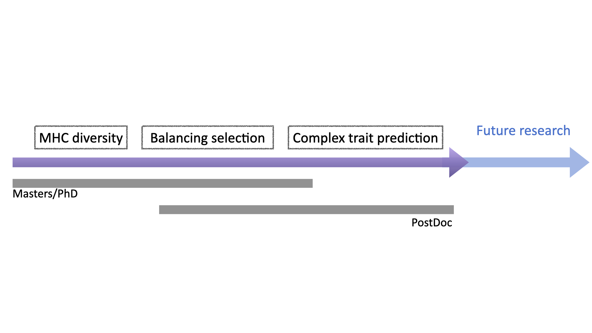
```
---
class: center, top
# Architecture of a genome
```{r, out.width = "910px",echo=FALSE, eval=T}
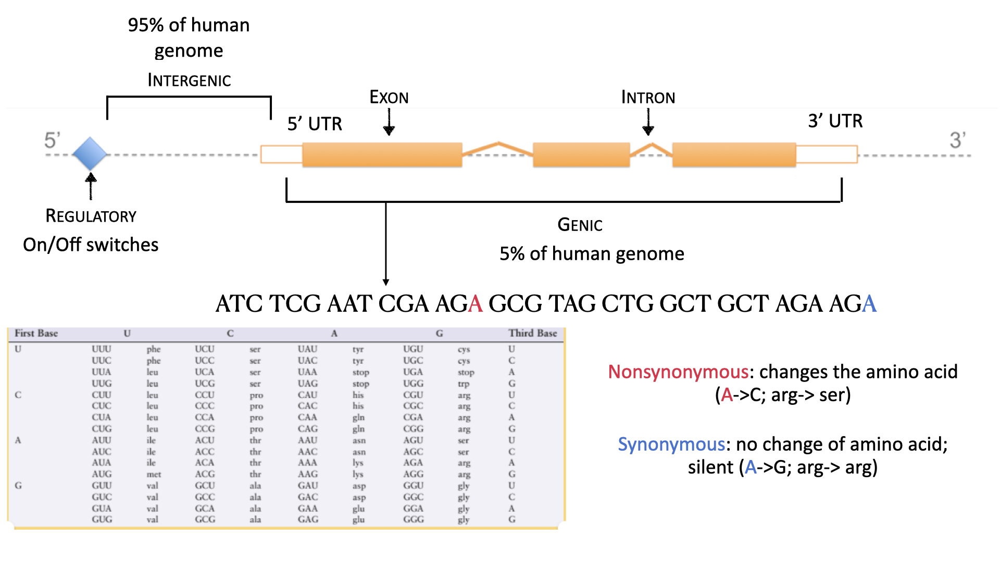
```
---
class: center, top

## Processes that shape genomic diversity in the .lilac[absense of selective pressures]
```{r, out.width = "1000px",echo=FALSE, eval=T}
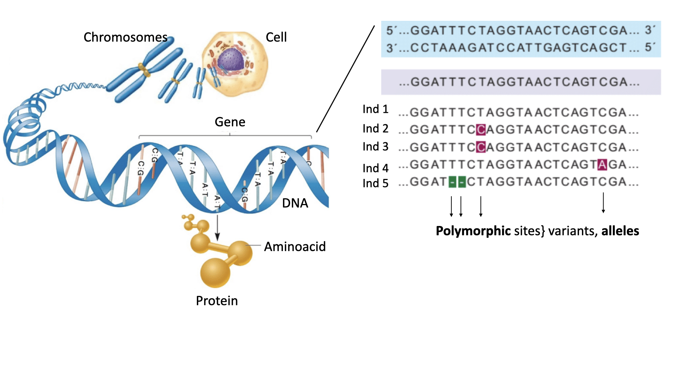
```
---
class: center, top

## .lilac[Selective processes] that shape genomic diversity
```{r, out.width = "1000px",echo=FALSE, eval=T}
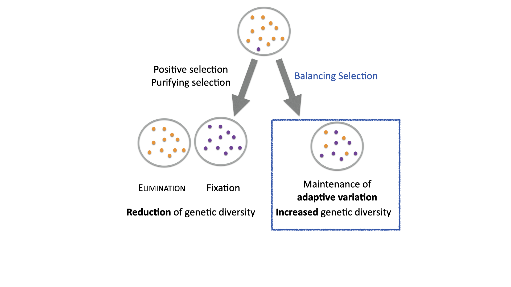
```
class: center, top
---
class: middle, left
## .lilac[Introduction]

## .lilac[Research Project 1: Heterozygote advantage in HLA genes]

## .pink[Research Project 2: Balancing selection in the human genome]

## .pink[Research Project 3: Polygenic scores for height in admixed populations]

## .pink[Conclusions & Future Directions]
---
class: center, top

## MHC molecules present antigens and unleash immune responses

```{r, out.width = "950px",echo=FALSE, eval=T}
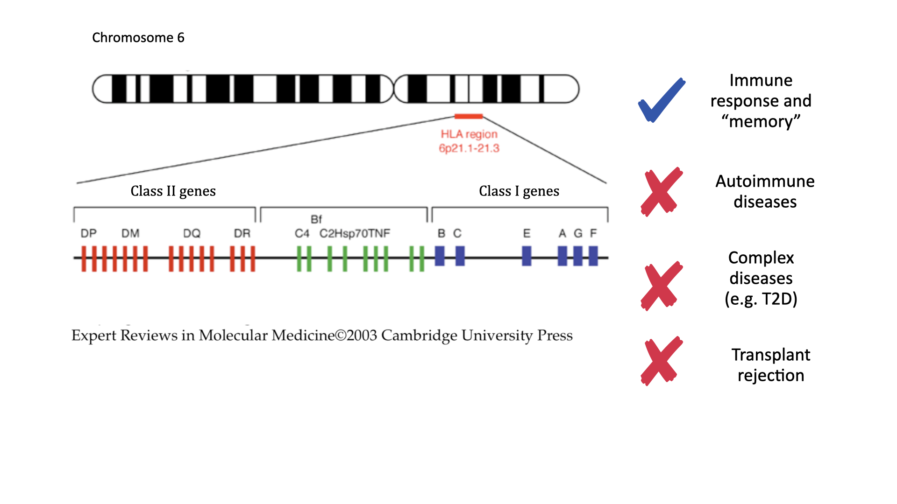
```

---
class: center, top
## MHC/HLA: an extreme instance of balancing selection

```{r, out.width = "1000px",echo=FALSE, eval=T}
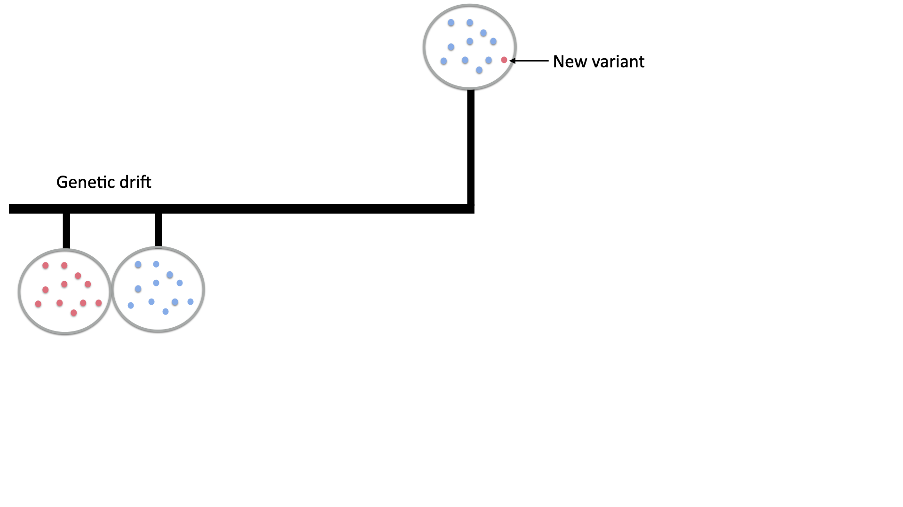
```
---

class: center, middle

# Is there support for the .lilac[divergent allele advantage model?]
---
class:  middle, left

## Is there support for the divergent allele advantage model?

#### .pink[Hypothesis:] divergent allele advantage model (heterozygote advantage is greater for genotypes with more divergent alleles) explains selective patterns in the HLA genes

#### .pink[Prediction:] increased signatures of balancing selection between pairs of HLA alleles that match different antigens
---
class: center, top
### To answer these questions, I looked at the human class I HLA genes

```{r, out.width = "1200px",echo=FALSE, eval=T}
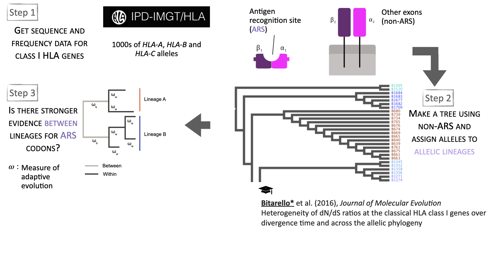
```
---
class: middle, left

## .lilac[Introduction]

## .lilac[Research Project 1: Heterozygote advantage in HLA genes]

## .lilac[Research Project 2: Balancing selection in the human genome]

## .pink[Research Project 3: Polygenic scores for height in admixed populations]

## .pink[Conclusions & Future Directions]
---

class: center, middle


# .lilac[How prevalent] has balancing selection been throughout human evolution? 

# What are the instances .lilac[beyond the MHC] loci?

---
class:top, left

### Can we devise a statistical test specific for signatures of balancing selection?

#### .pink[Approach:] combine independent signatures into one statistic

### If so, how prevalent has it been throughout human evolution?

#### .pink[Approach:] perform a genome-wide scan using a test specifically tailored for balancing selection

### Are there commn trends amongst the candidate regions/genes?

#### .pink[Approach:] Explore candidate regions/genes for common functions/patterns
---
class:left, top

## Can we devise a statistical test specific for signatures of balancing selection?

```{r, out.width = "930px",echo=FALSE, eval=T}
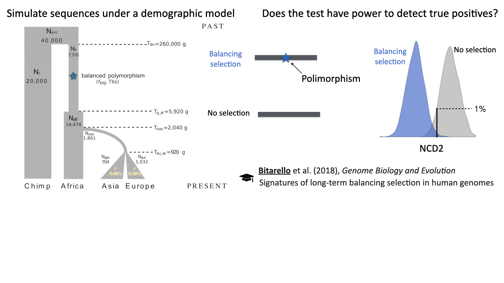
```

---
class:left, top
## A method to detect signatures of balancing selection
```{r, out.width = "1200px",echo=FALSE, eval=T}
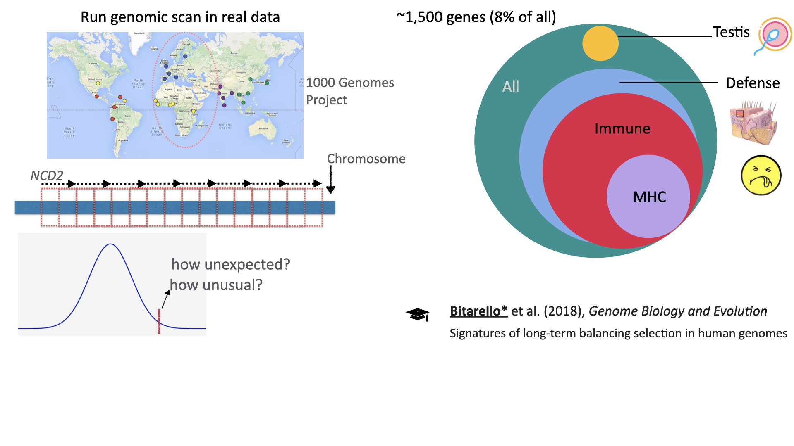
```
---

### Pervasiveness and targets of balancing selection in humans

```{r, out.width = "1000px",echo=FALSE, eval=T}
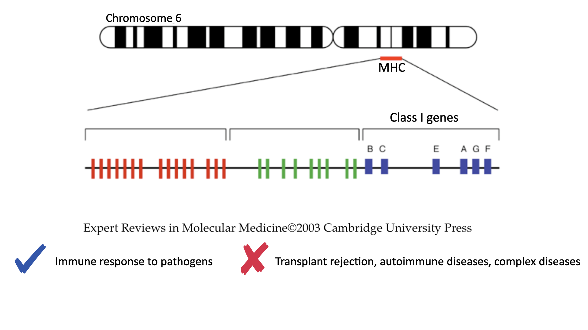
```
---
class: middle, left

## .lilac[Introduction]

## .lilac[Research Project 1: Heterozygote advantage in HLA genes]

## .lilac[Research Project 2: Balancing selection in the human genome]

## .lilac[Research Project 3: Polygenic scores for height in admixed populations]

## .pink[Conclusions & Future Directions]
---

class: center, top
## Genome-wide association studies (GWAS)

```{r, out.width = "970px",echo=FALSE, eval=T}
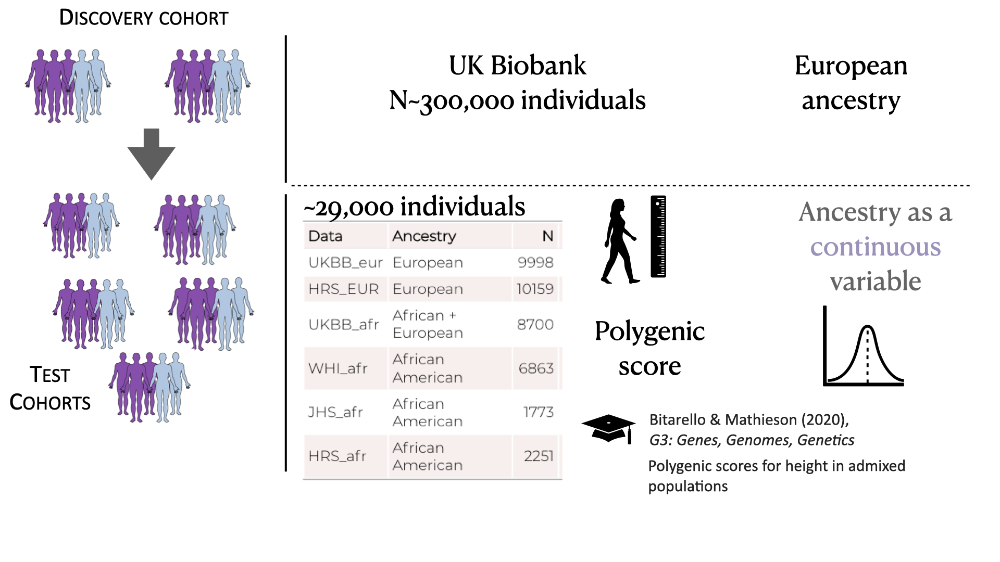
```

???
How are associated variants detected? Introducing: the GWAS. 
class:left, top

???
As hinted by this last slide, genetics is more complicated than simply 'good variants' get selected. Maladaptive variants can get fixated because of genetic drift, other variants can be good in certain situations but not others. So this is a good way to shift into the next topic of research, which revolves around disease risk prediction

---
class:center, top
##**Many** variants with **small** effect size

.pull-left[.full-width[
```{r, out.width = "600px",echo=FALSE, eval=T}
knitr::include_graphics("tam_et_al_2019_2.png")
```

Tam et al. (2019) *Nat Rev Genet*
]]

.pull-right[.full-width[

 .blue[Rare, monogenic diseases/traits:]
 
 phenylketonuria, sickle-cell anemia, Duchenne muscular dystrophia

.blue[complex, common diseases/traits:]

cardiovascular  disease, T2 diabetes, cancers, **height**, BMI
]]
???
A picture that has emerged from human genetics from a biomedical standpoint is that most genomic variants (or polymorphisms) that have a statistically significant association with a disease or trait are somewhat common (appreciable frequencies) and have a realtively small 'effect size'. On the other hand, what you may have learned as monogenic diseases/traits, such as muscualr distrofia

This results in the landscape of polygenic traits to look something like we see on the right: GWAS are mostly successful at capturing variants between these two diagonal lines: common, with moderate or small effect variants, and some rare but highly penetrant mutations, that is, that have a considerable effect size.
Rare variants with small effect sizes are difficult to identify using GWAS, and common variants with large effects are unusual for common complex diseases
---
class: inverse, middle, center

# .lilac[Combined, these variants can explain a lot!]

???

So you might be thinking this is bad news in terms of predicting outcomes. So although most of these variants we detect in genome-wide association studies have very small effect, when you add them up, they explain quite a lot of the variation in a trait.

---
class: middle, center
# Polygenic traits and their predictive power

```{r, echo=F}
dt2<-data.table(Phenotype=c('height', 'schizophrenia', 'ADHD'), Variance_Explained=c(25,7,5.5), Variants=c(3000,100,100))
knitr::kable(dt2)
```
### PS: for **Europeans** ancestry only...

???

To mention a few examples, height is one of the most well-studied and most polygenic traits we know of. So far more than 3,000 independently associated variants have been uncovered through GWAS and together they explain about 25% of variation in height as show by linear regression models. For schizophrenia and ADHD, those values are between 5.5-7%. That might seem low, but actually it isn't if you think about this...
---
class: center, top

## Polygenic risk scores combine .lilac[all variants] with an effect on the phenotype
.pull-left[.full-width[
```{r, out.width = "650px",echo=FALSE, eval=T}

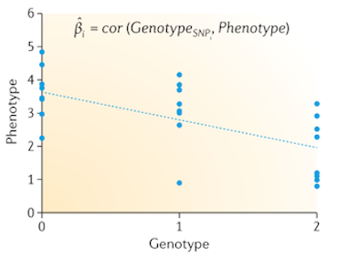
```

.small[Pasaniuc & Price (2017), *Nat Rev Genet*]


]]

.pull-right[.full-width[


$$PRS=\sum_{i=1}^{m} \hat\beta_{i} G_{j,i}$$ 


$\hat\beta$ : effect size (from GWAS)

$G$ : Effect allele dosage

$j$: Individuals

$i$: SNPs

**independence**

**additive model**

]]


???
So you did a GWAS for height. Then, for each variant in the genome you have something like this: the genotype in that locus has an effect on height, and can be modelled as a linear relationship. So you have an effect size for one allele in that locus, which is a correlation between the phenotype and the genotype. 

Then you make some assumptions about independence of these loci and that an additive model is appropriate and you have this polygenic score, which is a weighted sum of the genotypes in an individuals. Weighted by the effect sizes.
---
class: top, center
# PRSs are appealing


.pull-left[.full-width[
## **easy**

### **promising**

## **fast**

### **minimal requirements**
]]
.pull-right[.full-width[

#### Polygenic risk of cardiovascular disease
```{r, out.width = "400px",echo=FALSE, eval=T}
knitr::include_graphics("cad.png")
```

Khera et al. (2018), *Nat Genet*
]]

???
So as you can see from this, PRS are very appealing...They are easy and simple to implement, all you need are some summary statistics from a GWAS, and no further complicated modeling.

Here is one promising example. The x axis shows the percentile of polygenic score. And the y axis shows the pravalence of CAD. IF we look at the highest bins of PRS, prevalance of CAD is 10%. These individuals have a 8-fold increase of CAD compared to the rest of the population. This makes the PRS able to find 20-fold mroe people at risk for CAD than if you were simply testing for large effect mutations, which have large effect but are rare.
There are a few other examples like this sofar for breast cancer for instance.
The main point I want to emphasize is...This is for individuals with European ancestry.

---
class: middle, center, inverse

# .lilac[What about ancestry?]

???
right. So what about ancestry?
---
class: center, top
.pull-left[.full-width[
## European **ancestry** represent almost 80% of GWAS participants...
```{r, out.width = "350px",echo=FALSE, eval=T}
knitr::include_graphics("Screen Shot 2020-09-16 at 4.28.04 PM.png")
```

Sirugo, Williams & Tishkoff (2019), *Cell*]]
--
.pull-left[.full-width[

```{r, echo=FALSE, eval=T, out.width = "420px"}
world<-fread('~/Downloads/csvData.csv')
#library(plotly)
blank_theme <- theme_minimal()+
  theme(
  axis.title.x = element_blank(),
  axis.title.y = element_blank(),
  panel.border = element_blank(),
  panel.grid=element_blank(),
  axis.ticks = element_blank(),
  plot.title=element_text(size=14, face="bold")
  )
bp<- ggplot(world, aes(x="", y=WorldPop, fill=Name))+
geom_bar(width = 1, stat = "identity") + coord_polar("y", start=0)+ 
  scale_fill_manual(values=c("red","#E6A0C4","#7294D4", "#999999","#899DA4","#A2A475")) + blank_theme +
  theme(axis.text.x=element_blank()) + 
  geom_text(aes(y=c(0.9,0.4,0.17, 0.10, 0.05, 0.025), label=paste0((c(0.1720, 0.5954, 0.0959, 0.0473,0.0055, 0.0553)*100), "%")), size=c(6,6,6,6,2,3))
 
print(bp)
```
```{r, out.width = "650px",echo=FALSE, eval=F}
knitr::include_graphics("Screen Shot 2020-09-16 at 2.44.43 PM.png")
```
[Data: https://worldpopulationreview.com/]

## .. and <15% of the world's population
]]

???
Ok, so let's look at this pie chart from last year, with the proportion of individuals from Each of these groups of ancestry that appear in GWAS. Europeans make up almost 80%, Asians about 20% and Africans about 2%. Note that this is a big improvement since 2009. The same survey in 2009 showed that 96% of individuals were European!

Anyway, now look at this pie chart on the right, which I made from data from worldpopulationreview for 2020. Now, the colors are not a true match, but I did my best. BEar in mind that the plot on the left is about ancestry, and the one on the right is about continents, regardless of ancestry. Nevertheless, it's a reasonable approximation for this purpose. Europeans in Blue represent a disproportionate amount of GWAS participants especially if you consider their share of the world's population. Asian POPULATION represent 60% of the world and ASIAN ANCESTRY only 10% of GWAS, and African POPULATION 17 and AND AFRICAN ANCESTRY 2%. Not to mention the other ancestries which are virtually non-existent.
---
class: center, top
### How much do polygenic scores predict phenotypes in .pink[other populations?]


```{r, out.width = "1000px",echo=FALSE, eval=T}
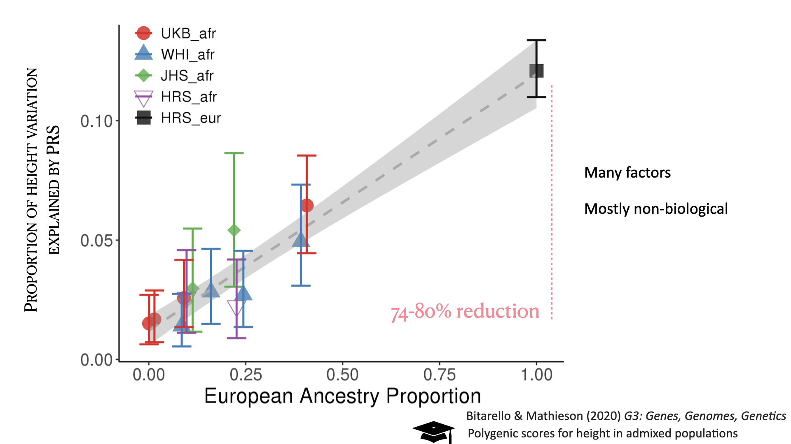
```


???
this is obviously not ideal and reflects many biases which I don't have time to go into to, but considering the hype i showed about PRS before, how does this affect popygenic risk score predictions?
Over the past two years or so a few papers have come out showing that prediction accuracy from PRS decreases with genetic distance from Europeans.
This figure from Martin et al showes average prediction accuracies for 17 traits, using GWAS summary statisticas derived from 100% European cohorts. I am not sure what american means?

---
class: middle, center


## How do these .lilac[different factors] affect prediction accuracy?


## What can we .lilac[do about it?]


???
So the questions that motivated this work were:
---
class: middle, left


## How do these different factors affect prediction accuracy?

#### .pink[Approach:] examine how well we can predict a highly heritable trait in different populations, based on an European ancestry discovery cohort and explore the roles of different biological/statistical factors

## What can we do about it?

#### .pink[Approach:] explore whether incorporating fine-scale ancestry information into these scores improves their performance

???
So the questions that motivated this work were:
---
class: middle, center

# .lilac[Let's look at] height
???
We chose to look at height in individuals with Eur, afr and admixed ancestry.
---
class:left, top
## Wow well can we predict a .lilac[highly heritable] trait?

```{r, out.width = "1000px",echo=FALSE, eval=T}
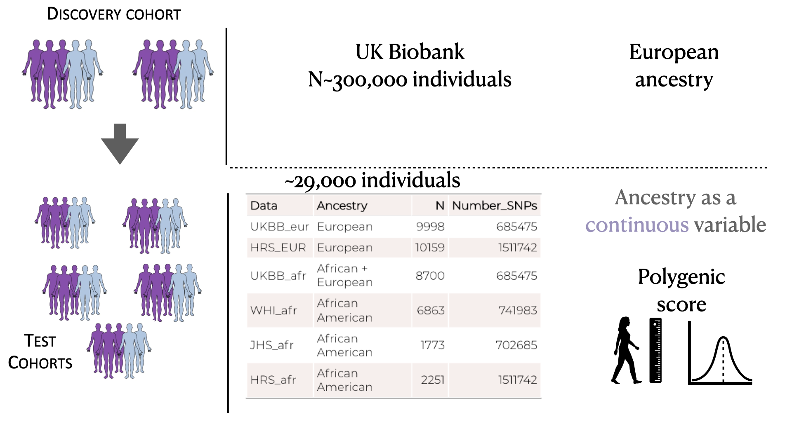
```


???
why height? It's a somehwat well-udnerstood trait. it's hgihly popygenic and easy to measure. It is highly heritable (80% based ont twin studies, about 50% based on SNP heritability)

So in this work we used GWAS summary statistics for height from a cohort of 360K europeans from the UK biobank. And we verified how well we could predicti height in individuals with different degrees of african ancestry.

Importantly, unlike most studies, we consdierted ancestry as a continuous variable. So each individuals we analysed had a "proportion of Eur ancestry" inferred by local ancestry inference and averaged across the genome.

In the end we looked at about 19,000 individuals with admied ancestry, and 10,000 with eur ancestry from different cohorts.

we modell height as a function of sex age and eur ancesty and compare that to a mdoel that also includes prs.
---
class:left, top
## Wow well can we predict a .lilac[highly heritable] trait in .lilac[different populations?]
```{r, out.width = "1000px",echo=FALSE, eval=T}
knitr::include_graphics("meat/schemas/schemas.018.png")
```

---
class:left, middle


## 1. .lilac[Introduction]

## 2. .lilac[Research Theme 1: Balancing selection in humans]

## 3. .lilac[Research Theme 2: Polygenic risk prediction for individuals with non-European ancestry] 

## 4. .pink[Conclusions & Future Directions]
---
class: left, middle


### .pink[How has balancing selection shaped diversity in the HLA loci?]


### .pink[How prevalent has balancing selection been throughout evolution and what are the common trends?]


### .pink[How useful are polygenic risk predictors for individuals with non-European ancestries?]


---
class: middle, left


### .pink[1)] There is support for the .blue[divergent allele advantage model] in HLA evolution


### .pink[2)] A novel test, specifc for balancing selection, revealed many new candidates, 1/3 of which are immune-related, and many others related to defense broadly and reproduction


### .pink[3)] At present, PRS approaches have little to no utility for individuals with non-European ancestry, many factors are responsible, need to diversify genetics studies at all stages

---
class:left, top
```{r, out.width = "1000px",echo=FALSE, eval=T}
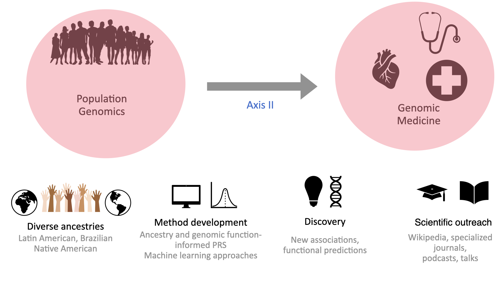
```
---
class: center, top
## Research Axis I: Balancing selection as a force that shapes diversity

```{r, out.width = "1000px",echo=FALSE, eval=T}
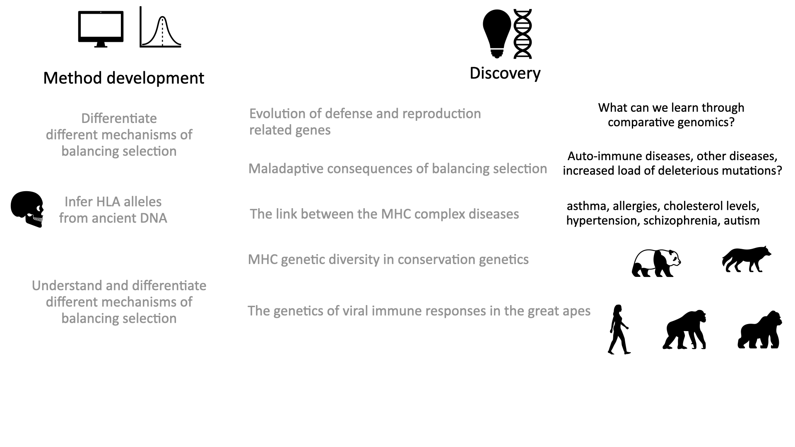
```
---
class: center, top
## Research Axis II: Polygenic risk prediction in admixed populations

```{r, out.width = "930px",echo=FALSE, eval=T}
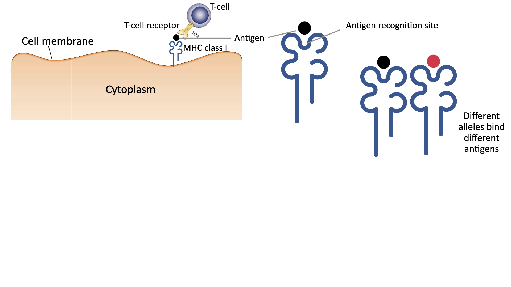
```
---
## A final thought

```{r, out.width = "1000px",echo=FALSE, eval=T}
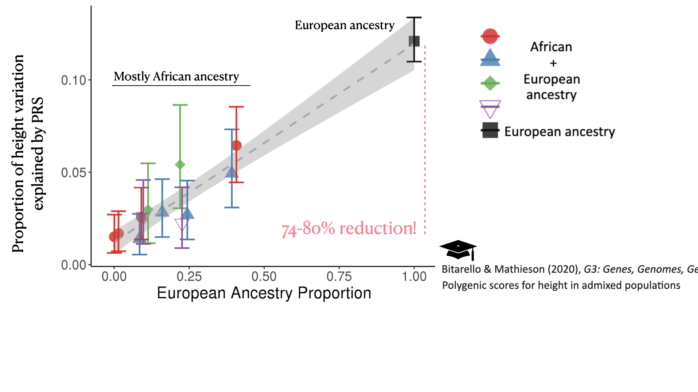
```
---
class: top, center
# Acknowledgements

.pull-left[.full-width[

**Iain Mathieson**

**Diogo Meyer**

**Aida Andrés**

Joshua Schmidt

Cesare de Filippo

Rodrigo dos Santos Francisco

Débora Brandt

]]

.pull-right[.full-width[
Neale Lab

UK Biobank

Women's Health Initiative

Jackson Heart Study

Health and Retirement Study

1000 Genomes Project
]]


```{r, out.width = "300px",echo=FALSE, eval=T}

```


---

class: inverse,center, middle

# .lilac[Thank you!]

# .lilac[Questions?]


